# Czasopisma w ewaluacji dyscyplin naukowych 2022-2025

Podsumowanie artykułów naukowych zgłoszonych przez polskie podmioty do ewaluacji jakości działalności naukowej za lata 2022-2025 (dane z 11.09.2026). Dla każdej dyscypliny pokazano najczęściej wykorzystywane czasopisma oraz mapę ciepła „podmiot x czasopismo”.

Dane: https://zenodo.org/records/22688357

Do analizy trafiło: 182 057 artykułów, 55 dyscyplin, 9 336 tytułów czasopism (po scaleniu wariantów zapisu). Monografie, rozdziały i redakcje naukowe nie są uwzględniane. 

## Disclaimer

- Analizy przygotowane na własny osobisty użytek. **Nie daję żadnych gwarancji, że ta hobbystyczna analiza jest w 100% poprawna. Jeżeli chce się z niej skorzystać warto samemu sprawdzić odpowiednie statystyki.**
- Informacje o ewentualnych błędach proszę zgłaszać przez issuesy. Można forkować i modfikować dowoli. Licencja CC-BY-SA-NC.
- W poniższym podsumowaniu wyróżniam czasopisma ze stajni MDPI, ale głównie dlatego, że obecna dyskusja toczy się wokół tego wydawcy. 
- Analizując wyniki należy zachować dużą ostrożność we wrzucaniu wszystkich czasopism jednego wydawcy do jednego worka. O jakości czasopisma świadczy wiele czynników takich jak skład komitetu programowego, doświadczenie i rzetelność edytorów jak i jakość prac zgłaszanych do danego czasopisma. Zarówno w MDPI jak i u innych wydawców znaleźć można dobre i słabe czasopisma, dobre i słabe artykuły. 
- Poniższe wizualizacje mają na celu umożliwienie zlokalizowanie sytuacji, którym warto się przyjrzeć bliżej (profil publikacji odbiegający od publikacji typowych dla najlepszych uczelni, koncentracja na małej licznie czasopism).
- Wykresy przedstawiają tylko najpopularniejsze czasopisma w danej dyscyplinie. Jeżeli jakiegoś brakuje, to nie znaczy że nikt tam nie publikuje, tylko, że nie uzbierało się wystarczająco wiele prac by dane czasopismo znalazło się w podsumowaniu.
- Analiza była możliwa ponieważ MNiSW udostępniło dane z parametryzacji (https://t.co/RksPLVbtZN). Doceniam. Dziękuję @DrAGrabowski za namiary na dane.
- Automatyzacja wspierana AI (od firmy na tę samą literę). Wszystkie wyniki generowane przez R a wykresy bazują na ggplot.

## Jak czytać wyniki

- % udziału to odsetek wszystkich artykułów danej dyscypliny opublikowanych w danym czasopiśmie.
- Gwiazdka (`*`) oznacza czasopismo wydawane przez MDPI; przynależność ustalana jest na podstawie ręcznej listy tytułów zawartej w skrypcie.
- Mapa ciepła pokazuje, jaki procent dorobku danego podmiotu przypada na poszczególne czasopisma (wiersze sumują się do 100% w obrębie 30 najczęstszych tytułów). Uwzględnia podmioty z co najmniej 30 artykułami w dyscyplinie.
- Pliki CSV: `*_kontyngencja.csv` – surowa tabela podmiot × czasopismo, `*_podmioty.csv` – zestawienie podmiotów (liczba artykułów, udział MDPI, liczba N, ocena w kryterium I).
- Kod źródłowy: [`analiza_czasopism_wg_dyscyplin.R`](analiza_czasopism_wg_dyscyplin.R). Zbiorcze podsumowanie: [`_podsumowanie_dyscyplin.csv`](czasopisma_dyscypliny/_podsumowanie_dyscyplin.csv).
- W dyscyplinach *informatyka* oraz *informatyka techniczna i telekomunikacja* dodatkowa sekcja pokazuje *materiały konferencyjne*, z podziałem konferencji na rangę CORE A\* i pozostałe (w informatyce konferencje są równorzędnym kanałem publikacji).

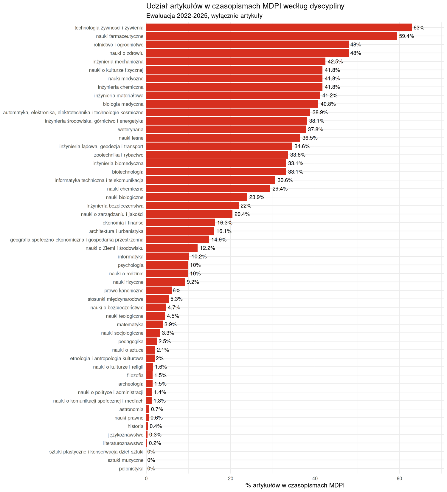

## Spis treści

1. [Archeologia](#archeologia)
2. [Architektura i urbanistyka](#architektura-i-urbanistyka)
3. [Astronomia](#astronomia)
4. [Automatyka, elektronika, elektrotechnika i technologie kosmiczne](#automatyka-elektronika-elektrotechnika-i-technologie-kosmiczne)
5. [Biologia medyczna](#biologia-medyczna)
6. [Biotechnologia](#biotechnologia)
7. [Ekonomia i finanse](#ekonomia-i-finanse)
8. [Etnologia i antropologia kulturowa](#etnologia-i-antropologia-kulturowa)
9. [Filozofia](#filozofia)
10. [Geografia społeczno-ekonomiczna i gospodarka przestrzenna](#geografia-społeczno-ekonomiczna-i-gospodarka-przestrzenna)
11. [Historia](#historia)
12. [Informatyka](#informatyka)
13. [Informatyka techniczna i telekomunikacja](#informatyka-techniczna-i-telekomunikacja)
14. [Inżynieria bezpieczeństwa](#inżynieria-bezpieczeństwa)
15. [Inżynieria biomedyczna](#inżynieria-biomedyczna)
16. [Inżynieria chemiczna](#inżynieria-chemiczna)
17. [Inżynieria lądowa, geodezja i transport](#inżynieria-lądowa-geodezja-i-transport)
18. [Inżynieria materiałowa](#inżynieria-materiałowa)
19. [Inżynieria mechaniczna](#inżynieria-mechaniczna)
20. [Inżynieria środowiska, górnictwo i energetyka](#inżynieria-środowiska-górnictwo-i-energetyka)
21. [Językoznawstwo](#językoznawstwo)
22. [Literaturoznawstwo](#literaturoznawstwo)
23. [Matematyka](#matematyka)
24. [Nauki biblijne](#nauki-biblijne)
25. [Nauki biologiczne](#nauki-biologiczne)
26. [Nauki chemiczne](#nauki-chemiczne)
27. [Nauki farmaceutyczne](#nauki-farmaceutyczne)
28. [Nauki fizyczne](#nauki-fizyczne)
29. [Nauki leśne](#nauki-leśne)
30. [Nauki medyczne](#nauki-medyczne)
31. [Nauki o bezpieczeństwie](#nauki-o-bezpieczeństwie)
32. [Nauki o komunikacji społecznej i mediach](#nauki-o-komunikacji-społecznej-i-mediach)
33. [Nauki o kulturze fizycznej](#nauki-o-kulturze-fizycznej)
34. [Nauki o kulturze i religii](#nauki-o-kulturze-i-religii)
35. [Nauki o polityce i administracji](#nauki-o-polityce-i-administracji)
36. [Nauki o rodzinie](#nauki-o-rodzinie)
37. [Nauki o sztuce](#nauki-o-sztuce)
38. [Nauki o zarządzaniu i jakości](#nauki-o-zarządzaniu-i-jakości)
39. [Nauki o zdrowiu](#nauki-o-zdrowiu)
40. [Nauki o Ziemi i środowisku](#nauki-o-ziemi-i-środowisku)
41. [Nauki prawne](#nauki-prawne)
42. [Nauki socjologiczne](#nauki-socjologiczne)
43. [Nauki teologiczne](#nauki-teologiczne)
44. [Pedagogika](#pedagogika)
45. [Polonistyka](#polonistyka)
46. [Prawo kanoniczne](#prawo-kanoniczne)
47. [Psychologia](#psychologia)
48. [Rolnictwo i ogrodnictwo](#rolnictwo-i-ogrodnictwo)
49. [Stosunki międzynarodowe](#stosunki-międzynarodowe)
50. [Sztuki filmowe i teatralne](#sztuki-filmowe-i-teatralne)
51. [Sztuki muzyczne](#sztuki-muzyczne)
52. [Sztuki plastyczne i konserwacja dzieł sztuki](#sztuki-plastyczne-i-konserwacja-dzieł-sztuki)
53. [Technologia żywności i żywienia](#technologia-żywności-i-żywienia)
54. [Weterynaria](#weterynaria)
55. [Zootechnika i rybactwo](#zootechnika-i-rybactwo)

## Archeologia

Artykuły: **1 095** · podmioty: **12** · czasopisma: **185** · udział MDPI: **1.5%**

| # | Czasopismo | Artykuły | % udziału |
|---|------------|---------:|----------:|
| 1 | Journal of Archaeological Science: Reports | 91 | 8.3% |
| 2 | Sprawozdania Archeologiczne | 81 | 7.4% |
| 3 | Antiquity | 79 | 7.2% |
| 4 | Prähistorische Zeitschrift | 60 | 5.5% |
| 5 | Polish Archaeology in the Mediterranean | 51 | 4.7% |

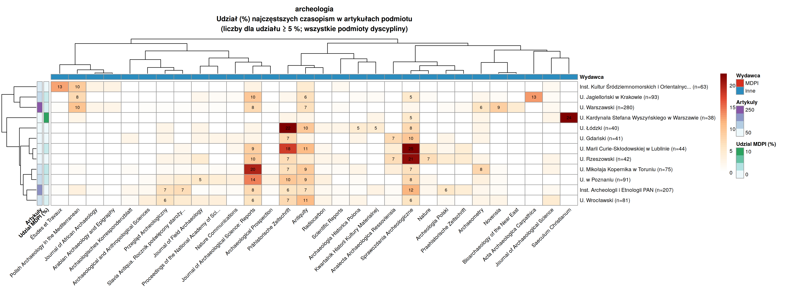

Dane: [tabela podmiot × czasopismo](czasopisma_dyscypliny/archeologia_kontyngencja.csv) · [zestawienie podmiotów](czasopisma_dyscypliny/archeologia_podmioty.csv) · [analiza korespondencji](czasopisma_dyscypliny/archeologia_korespondencja.png)

[↑ spis treści](#spis-treści)

## Architektura i urbanistyka

Artykuły: **1 915** · podmioty: **18** · czasopisma: **244** · udział MDPI: **16.1%**

| # | Czasopismo | Artykuły | % udziału |
|---|------------|---------:|----------:|
| 1 | Sustainability \* | 151 | 7.9% |
| 2 | Builder | 141 | 7.4% |
| 3 | Architectus | 132 | 6.9% |
| 4 | Środowisko Mieszkaniowe | 113 | 5.9% |
| 5 | Przestrzeń i Forma | 105 | 5.5% |

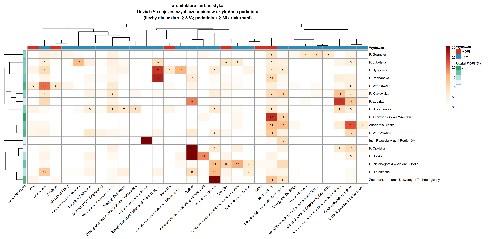

Dane: [tabela podmiot × czasopismo](czasopisma_dyscypliny/architektura_i_urbanistyka_kontyngencja.csv) · [zestawienie podmiotów](czasopisma_dyscypliny/architektura_i_urbanistyka_podmioty.csv) · [analiza korespondencji](czasopisma_dyscypliny/architektura_i_urbanistyka_korespondencja.png)

[↑ spis treści](#spis-treści)

## Astronomia

Artykuły: **692** · podmioty: **8** · czasopisma: **44** · udział MDPI: **0.7%**

| # | Czasopismo | Artykuły | % udziału |
|---|------------|---------:|----------:|
| 1 | Astronomy and Astrophysics | 224 | 32.4% |
| 2 | Monthly Notices of the Royal Astronomical Society | 86 | 12.4% |
| 3 | Astrophysical Journal Letters | 80 | 11.6% |
| 4 | Astrophysical Journal | 74 | 10.7% |
| 5 | Astrophysical Journal, Supplement Series | 51 | 7.4% |

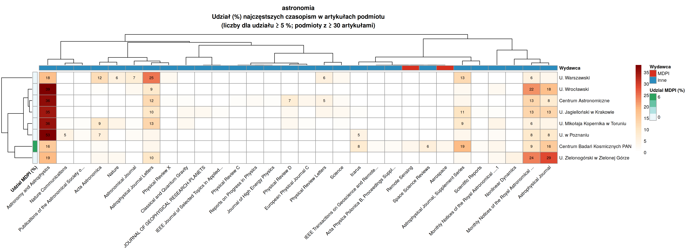

Dane: [tabela podmiot × czasopismo](czasopisma_dyscypliny/astronomia_kontyngencja.csv) · [zestawienie podmiotów](czasopisma_dyscypliny/astronomia_podmioty.csv) · [analiza korespondencji](czasopisma_dyscypliny/astronomia_korespondencja.png)

[↑ spis treści](#spis-treści)

## Automatyka, elektronika, elektrotechnika i technologie kosmiczne

Artykuły: **5 884** · podmioty: **27** · czasopisma: **700** · udział MDPI: **38.9%**

| # | Czasopismo | Artykuły | % udziału |
|---|------------|---------:|----------:|
| 1 | Energies \* | 1101 | 18.7% |
| 2 | Przegląd Elektrotechniczny | 567 | 9.6% |
| 3 | Sensors \* | 318 | 5.4% |
| 4 | Applied Sciences \* | 286 | 4.9% |
| 5 | Electronics \* | 261 | 4.4% |

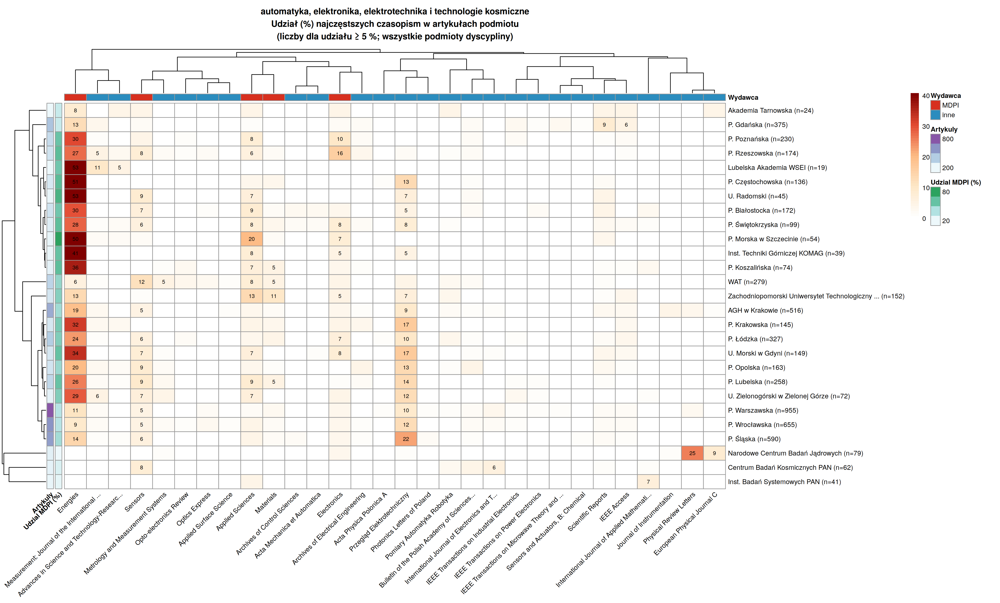

Dane: [tabela podmiot × czasopismo](czasopisma_dyscypliny/automatyka_elektronika_elektrotechnika_i_technologie_kosmiczne_kontyngencja.csv) · [zestawienie podmiotów](czasopisma_dyscypliny/automatyka_elektronika_elektrotechnika_i_technologie_kosmiczne_podmioty.csv) · [analiza korespondencji](czasopisma_dyscypliny/automatyka_elektronika_elektrotechnika_i_technologie_kosmiczne_korespondencja.png)

[↑ spis treści](#spis-treści)

## Biologia medyczna

Artykuły: **147** · podmioty: **3** · czasopisma: **68** · udział MDPI: **40.8%**

| # | Czasopismo | Artykuły | % udziału |
|---|------------|---------:|----------:|
| 1 | International Journal of Molecular Sciences \* | 23 | 15.6% |
| 2 | Molecules \* | 11 | 7.5% |
| 3 | Scientific Reports | 10 | 6.8% |
| 4 | Cancers \* | 9 | 6.1% |
| 5 | Journal of Clinical Medicine \* | 8 | 5.4% |

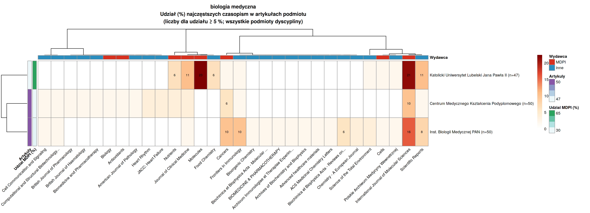

Dane: [tabela podmiot × czasopismo](czasopisma_dyscypliny/biologia_medyczna_kontyngencja.csv) · [zestawienie podmiotów](czasopisma_dyscypliny/biologia_medyczna_podmioty.csv)

[↑ spis treści](#spis-treści)

## Biotechnologia

Artykuły: **614** · podmioty: **8** · czasopisma: **219** · udział MDPI: **33.1%**

| # | Czasopismo | Artykuły | % udziału |
|---|------------|---------:|----------:|
| 1 | International Journal of Molecular Sciences \* | 99 | 16.1% |
| 2 | Scientific Reports | 46 | 7.5% |
| 3 | Molecules \* | 45 | 7.3% |
| 4 | Nucleic Acids Research | 14 | 2.3% |
| 5 | Frontiers in Immunology | 13 | 2.1% |

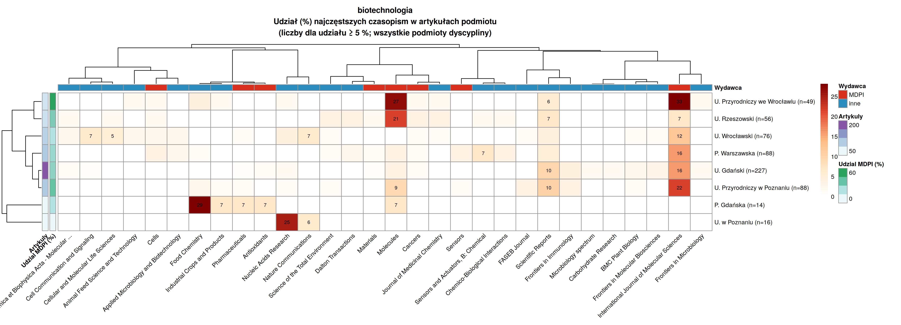

Dane: [tabela podmiot × czasopismo](czasopisma_dyscypliny/biotechnologia_kontyngencja.csv) · [zestawienie podmiotów](czasopisma_dyscypliny/biotechnologia_podmioty.csv) · [analiza korespondencji](czasopisma_dyscypliny/biotechnologia_korespondencja.png)

[↑ spis treści](#spis-treści)

## Ekonomia i finanse

Artykuły: **7 282** · podmioty: **50** · czasopisma: **1 092** · udział MDPI: **16.3%**

| # | Czasopismo | Artykuły | % udziału |
|---|------------|---------:|----------:|
| 1 | Energies \* | 627 | 8.6% |
| 2 | Sustainability \* | 330 | 4.5% |
| 3 | Zeszyty Naukowe Politechniki Śląskiej. Seria Organizacja i Zarządzanie | 323 | 4.4% |
| 4 | European Research Studies Journal | 317 | 4.4% |
| 5 | Economics and Environment | 205 | 2.8% |

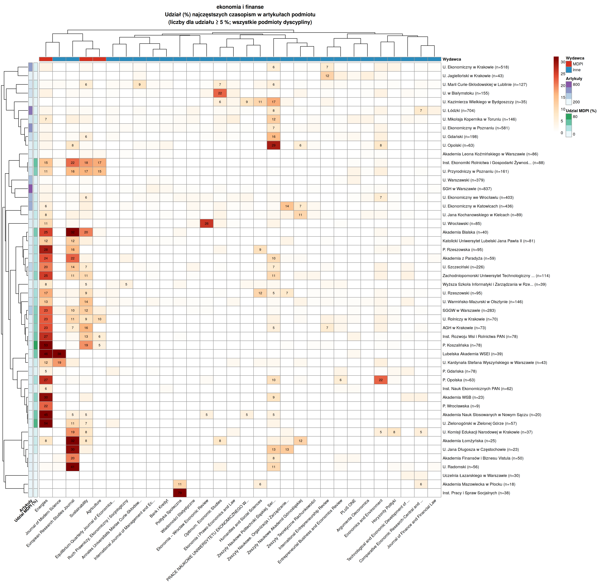

Dane: [tabela podmiot × czasopismo](czasopisma_dyscypliny/ekonomia_i_finanse_kontyngencja.csv) · [zestawienie podmiotów](czasopisma_dyscypliny/ekonomia_i_finanse_podmioty.csv) · [analiza korespondencji](czasopisma_dyscypliny/ekonomia_i_finanse_korespondencja.png)

[↑ spis treści](#spis-treści)

## Etnologia i antropologia kulturowa

Artykuły: **196** · podmioty: **5** · czasopisma: **92** · udział MDPI: **2.0%**

| # | Czasopismo | Artykuły | % udziału |
|---|------------|---------:|----------:|
| 1 | Lud | 16 | 8.2% |
| 2 | Konteksty: Polska Sztuka Ludowa | 12 | 6.1% |
| 3 | Etnografia. Praktyki, Teorie, Doświadczenia | 9 | 4.6% |
| 4 | Łódzkie Studia Etnograficzne | 9 | 4.6% |
| 5 | Journal of Urban Ethnology | 8 | 4.1% |

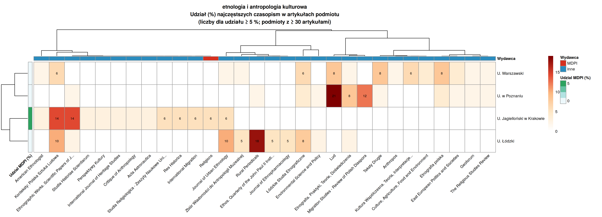

Dane: [tabela podmiot × czasopismo](czasopisma_dyscypliny/etnologia_i_antropologia_kulturowa_kontyngencja.csv) · [zestawienie podmiotów](czasopisma_dyscypliny/etnologia_i_antropologia_kulturowa_podmioty.csv) · [analiza korespondencji](czasopisma_dyscypliny/etnologia_i_antropologia_kulturowa_korespondencja.png)

[↑ spis treści](#spis-treści)

## Filozofia

Artykuły: **1 714** · podmioty: **24** · czasopisma: **405** · udział MDPI: **1.5%**

| # | Czasopismo | Artykuły | % udziału |
|---|------------|---------:|----------:|
| 1 | Roczniki Filozoficzne | 151 | 8.8% |
| 2 | Synthese | 75 | 4.4% |
| 3 | Analiza i Egzystencja | 70 | 4.1% |
| 4 | Przegląd Filozoficzny - Nowa Seria | 59 | 3.4% |
| 5 | Studia Gilsoniana | 45 | 2.6% |

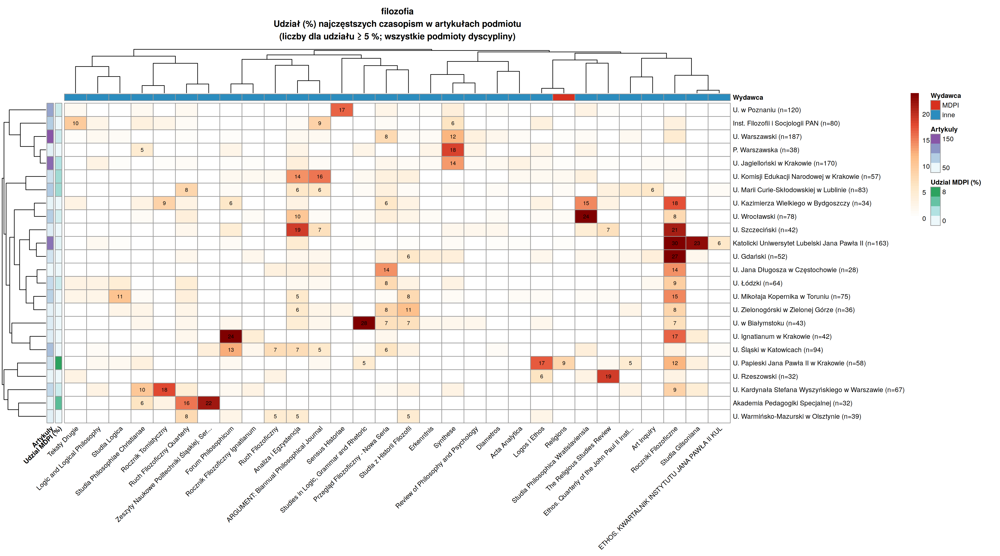

Dane: [tabela podmiot × czasopismo](czasopisma_dyscypliny/filozofia_kontyngencja.csv) · [zestawienie podmiotów](czasopisma_dyscypliny/filozofia_podmioty.csv) · [analiza korespondencji](czasopisma_dyscypliny/filozofia_korespondencja.png)

[↑ spis treści](#spis-treści)

## Geografia społeczno-ekonomiczna i gospodarka przestrzenna

Artykuły: **1 568** · podmioty: **19** · czasopisma: **379** · udział MDPI: **14.9%**

| # | Czasopismo | Artykuły | % udziału |
|---|------------|---------:|----------:|
| 1 | Sustainability \* | 114 | 7.3% |
| 2 | European Research Studies Journal | 69 | 4.4% |
| 3 | Regional Development and Regional Policy | 61 | 3.9% |
| 4 | Prace i Studia Geograficzne | 46 | 2.9% |
| 5 | Bulletin of Geography | 45 | 2.9% |

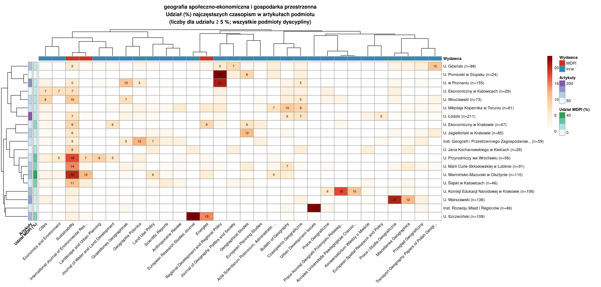

Dane: [tabela podmiot × czasopismo](czasopisma_dyscypliny/geografia_spoleczno_ekonomiczna_i_gospodarka_przestrzenna_kontyngencja.csv) · [zestawienie podmiotów](czasopisma_dyscypliny/geografia_spoleczno_ekonomiczna_i_gospodarka_przestrzenna_podmioty.csv) · [analiza korespondencji](czasopisma_dyscypliny/geografia_spoleczno_ekonomiczna_i_gospodarka_przestrzenna_korespondencja.png)

[↑ spis treści](#spis-treści)

## Historia

Artykuły: **2 930** · podmioty: **30** · czasopisma: **487** · udział MDPI: **0.4%**

| # | Czasopismo | Artykuły | % udziału |
|---|------------|---------:|----------:|
| 1 | Res Historica | 193 | 6.6% |
| 2 | Historia Slavorum Occidentis | 87 | 3.0% |
| 3 | Kwartalnik Historyczny | 87 | 3.0% |
| 4 | Klio. Czasopismo poświęcone dziejom Polski i powszechnym | 85 | 2.9% |
| 5 | Dzieje Najnowsze | 82 | 2.8% |

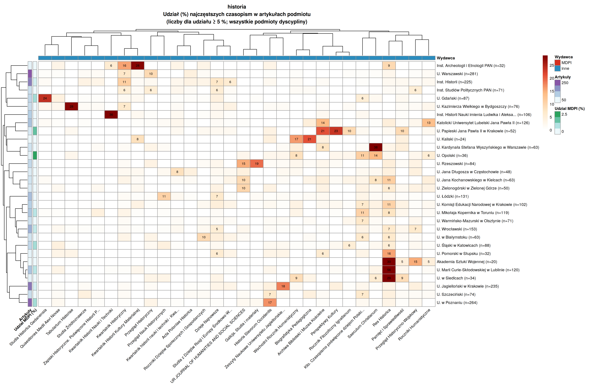

Dane: [tabela podmiot × czasopismo](czasopisma_dyscypliny/historia_kontyngencja.csv) · [zestawienie podmiotów](czasopisma_dyscypliny/historia_podmioty.csv) · [analiza korespondencji](czasopisma_dyscypliny/historia_korespondencja.png)

[↑ spis treści](#spis-treści)

## Informatyka

Artykuły: **371** · podmioty: **11** · czasopisma: **177** · udział MDPI: **10.2%**

| # | Czasopismo | Artykuły | % udziału |
|---|------------|---------:|----------:|
| 1 | Studia Informatica. Systems and Information Technology | 19 | 5.1% |
| 2 | SIAM Journal on Computing | 15 | 4.0% |
| 3 | Artificial Intelligence | 10 | 2.7% |
| 4 | Formalized Mathematics | 10 | 2.7% |
| 5 | Sensors \* | 9 | 2.4% |

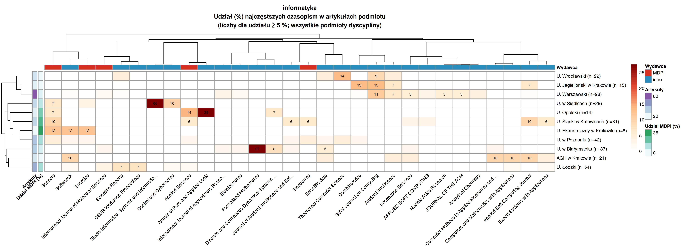

Dane: [tabela podmiot × czasopismo](czasopisma_dyscypliny/informatyka_kontyngencja.csv) · [zestawienie podmiotów](czasopisma_dyscypliny/informatyka_podmioty.csv) · [analiza korespondencji](czasopisma_dyscypliny/informatyka_korespondencja.png)

### Materiały konferencyjne

Materiały konferencyjne: **557** · podmioty: **11** · konferencje: **109** · udział konferencji rangi CORE A\*: **48.3%**

W tej tabeli gwiazdka (`*`) oznacza konferencję rangi **CORE A\***, a nie wydawcę MDPI.

| # | Konferencja | Materiały | % udziału |
|---|-------------|----------:|----------:|
| 1 | International Conference on Computational Science | 52 | 9.3% |
| 2 | IEEE Symposium on Logic in Computer Science \* | 34 | 6.1% |
| 3 | International Conference on Information Systems Development | 27 | 4.8% |
| 4 | National Conference of the American Association for Artificial Intelligence \* | 26 | 4.7% |
| 5 | ACM/SIAM Symposium on Discrete Algorithms \* | 23 | 4.1% |

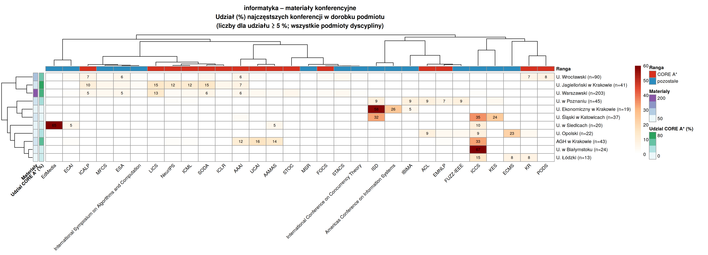

Dane: [tabela podmiot × konferencja](czasopisma_dyscypliny/informatyka_konferencje_kontyngencja.csv) · [zestawienie podmiotów](czasopisma_dyscypliny/informatyka_konferencje_podmioty.csv) · [analiza korespondencji](czasopisma_dyscypliny/informatyka_konferencje_korespondencja.png)

[↑ spis treści](#spis-treści)

## Informatyka techniczna i telekomunikacja

Artykuły: **4 358** · podmioty: **46** · czasopisma: **759** · udział MDPI: **30.6%**

| # | Czasopismo | Artykuły | % udziału |
|---|------------|---------:|----------:|
| 1 | Applied Sciences \* | 379 | 8.7% |
| 2 | Sensors \* | 309 | 7.1% |
| 3 | Scientific Reports | 182 | 4.2% |
| 4 | Electronics \* | 171 | 3.9% |
| 5 | Energies \* | 164 | 3.8% |

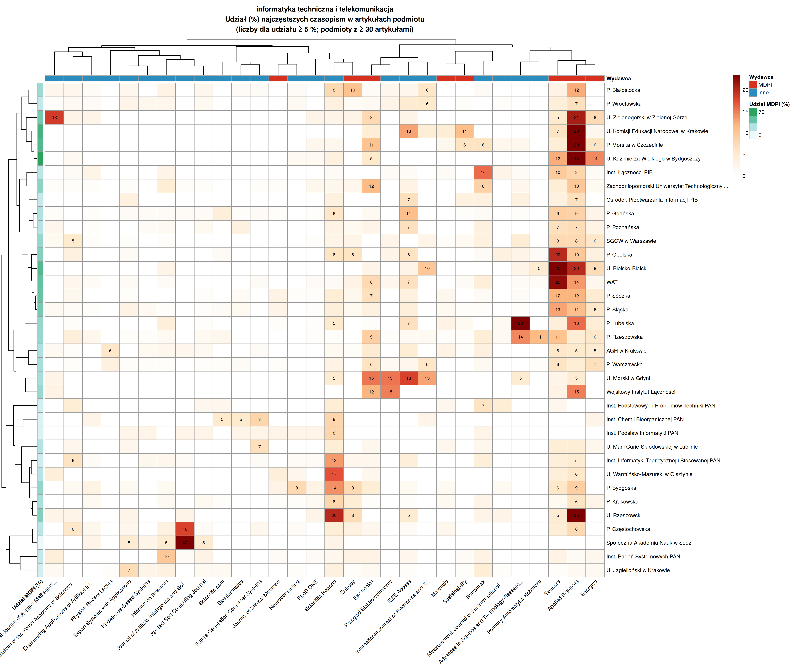

Dane: [tabela podmiot × czasopismo](czasopisma_dyscypliny/informatyka_techniczna_i_telekomunikacja_kontyngencja.csv) · [zestawienie podmiotów](czasopisma_dyscypliny/informatyka_techniczna_i_telekomunikacja_podmioty.csv) · [analiza korespondencji](czasopisma_dyscypliny/informatyka_techniczna_i_telekomunikacja_korespondencja.png)

### Materiały konferencyjne

Materiały konferencyjne: **1 829** · podmioty: **46** · konferencje: **203** · udział konferencji rangi CORE A\*: **18.8%**

W tej tabeli gwiazdka (`*`) oznacza konferencję rangi **CORE A\***, a nie wydawcę MDPI.

| # | Konferencja | Materiały | % udziału |
|---|-------------|----------:|----------:|
| 1 | International Conference on Computational Science | 317 | 17.3% |
| 2 | International Conference on Information Systems Development | 122 | 6.7% |
| 3 | International Conference on Knowledge-Based and Intelligent Information and Engineering Systems | 117 | 6.4% |
| 4 | European Conference on Artificial Intelligence | 94 | 5.1% |
| 5 | Genetic and Evolutionary Computations | 68 | 3.7% |

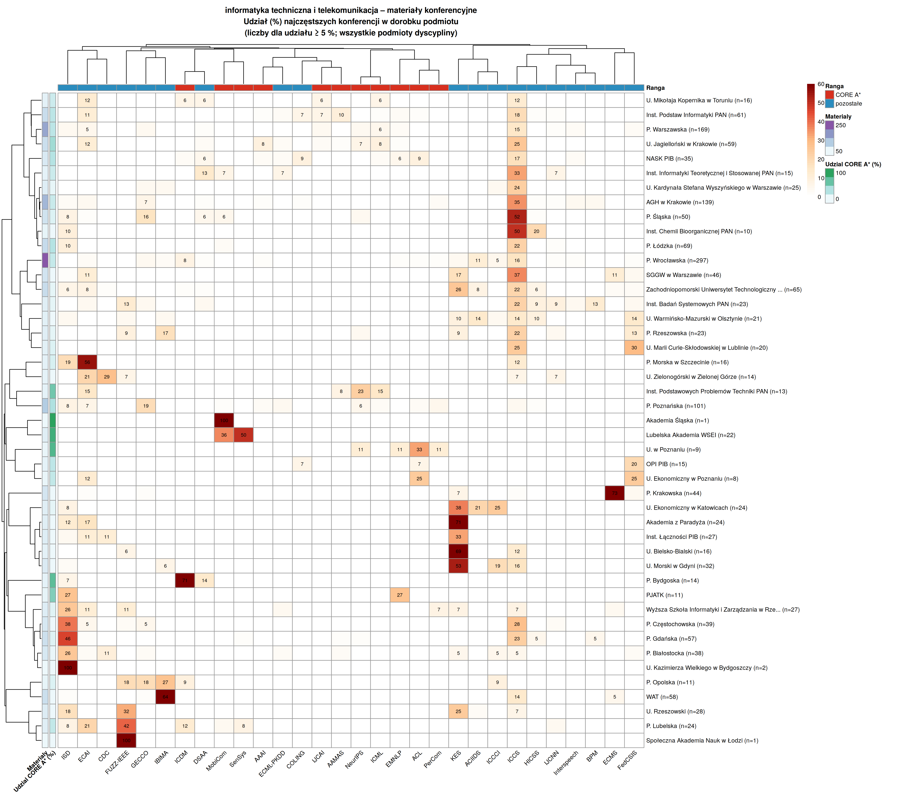

Dane: [tabela podmiot × konferencja](czasopisma_dyscypliny/informatyka_techniczna_i_telekomunikacja_konferencje_kontyngencja.csv) · [zestawienie podmiotów](czasopisma_dyscypliny/informatyka_techniczna_i_telekomunikacja_konferencje_podmioty.csv) · [analiza korespondencji](czasopisma_dyscypliny/informatyka_techniczna_i_telekomunikacja_konferencje_korespondencja.png)

[↑ spis treści](#spis-treści)

## Inżynieria bezpieczeństwa

Artykuły: **91** · podmioty: **3** · czasopisma: **46** · udział MDPI: **22.0%**

| # | Czasopismo | Artykuły | % udziału |
|---|------------|---------:|----------:|
| 1 | Przegląd Elektrotechniczny | 10 | 11.0% |
| 2 | Materials \* | 8 | 8.8% |
| 3 | Zeszyty Naukowe SGSP | 7 | 7.7% |
| 4 | Energies \* | 5 | 5.5% |
| 5 | Scientific Reports | 5 | 5.5% |

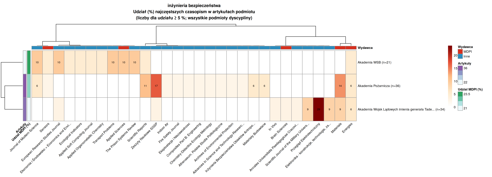

Dane: [tabela podmiot × czasopismo](czasopisma_dyscypliny/inzynieria_bezpieczenstwa_kontyngencja.csv) · [zestawienie podmiotów](czasopisma_dyscypliny/inzynieria_bezpieczenstwa_podmioty.csv)

[↑ spis treści](#spis-treści)

## Inżynieria biomedyczna

Artykuły: **1 157** · podmioty: **10** · czasopisma: **352** · udział MDPI: **33.1%**

| # | Czasopismo | Artykuły | % udziału |
|---|------------|---------:|----------:|
| 1 | Scientific Reports | 93 | 8.0% |
| 2 | International Journal of Molecular Sciences \* | 75 | 6.5% |
| 3 | Journal of Clinical Medicine \* | 56 | 4.8% |
| 4 | Materials \* | 52 | 4.5% |
| 5 | Sensors \* | 42 | 3.6% |

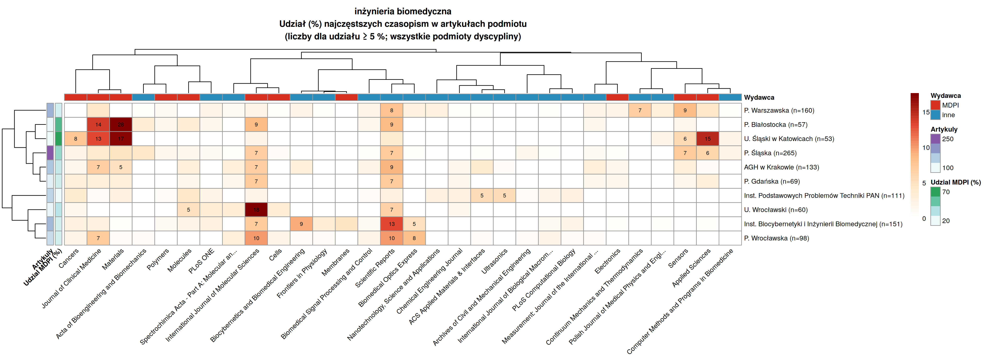

Dane: [tabela podmiot × czasopismo](czasopisma_dyscypliny/inzynieria_biomedyczna_kontyngencja.csv) · [zestawienie podmiotów](czasopisma_dyscypliny/inzynieria_biomedyczna_podmioty.csv) · [analiza korespondencji](czasopisma_dyscypliny/inzynieria_biomedyczna_korespondencja.png)

[↑ spis treści](#spis-treści)

## Inżynieria chemiczna

Artykuły: **2 137** · podmioty: **12** · czasopisma: **355** · udział MDPI: **41.8%**

| # | Czasopismo | Artykuły | % udziału |
|---|------------|---------:|----------:|
| 1 | Materials \* | 269 | 12.6% |
| 2 | Molecules \* | 223 | 10.4% |
| 3 | Energies \* | 122 | 5.7% |
| 4 | International Journal of Molecular Sciences \* | 99 | 4.6% |
| 5 | Scientific Reports | 65 | 3.0% |

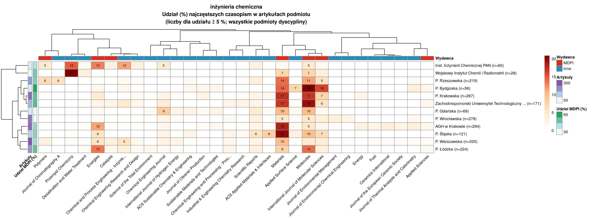

Dane: [tabela podmiot × czasopismo](czasopisma_dyscypliny/inzynieria_chemiczna_kontyngencja.csv) · [zestawienie podmiotów](czasopisma_dyscypliny/inzynieria_chemiczna_podmioty.csv) · [analiza korespondencji](czasopisma_dyscypliny/inzynieria_chemiczna_korespondencja.png)

[↑ spis treści](#spis-treści)

## Inżynieria lądowa, geodezja i transport

Artykuły: **6 387** · podmioty: **34** · czasopisma: **634** · udział MDPI: **34.6%**

| # | Czasopismo | Artykuły | % udziału |
|---|------------|---------:|----------:|
| 1 | Materials \* | 807 | 12.6% |
| 2 | Materiały Budowlane | 566 | 8.9% |
| 3 | Energies \* | 507 | 7.9% |
| 4 | Applied Sciences \* | 308 | 4.8% |
| 5 | Archives of Civil Engineering | 305 | 4.8% |

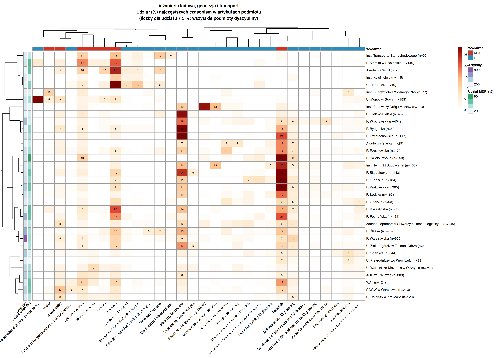

Dane: [tabela podmiot × czasopismo](czasopisma_dyscypliny/inzynieria_ladowa_geodezja_i_transport_kontyngencja.csv) · [zestawienie podmiotów](czasopisma_dyscypliny/inzynieria_ladowa_geodezja_i_transport_podmioty.csv) · [analiza korespondencji](czasopisma_dyscypliny/inzynieria_ladowa_geodezja_i_transport_korespondencja.png)

[↑ spis treści](#spis-treści)

## Inżynieria materiałowa

Artykuły: **3 906** · podmioty: **23** · czasopisma: **388** · udział MDPI: **41.2%**

| # | Czasopismo | Artykuły | % udziału |
|---|------------|---------:|----------:|
| 1 | Materials \* | 1215 | 31.1% |
| 2 | Archives of Civil and Mechanical Engineering | 146 | 3.7% |
| 3 | Scientific Reports | 137 | 3.5% |
| 4 | International Journal of Molecular Sciences \* | 107 | 2.7% |
| 5 | Molecules \* | 107 | 2.7% |

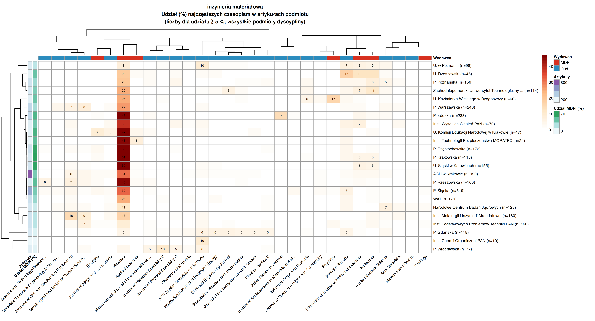

Dane: [tabela podmiot × czasopismo](czasopisma_dyscypliny/inzynieria_materialowa_kontyngencja.csv) · [zestawienie podmiotów](czasopisma_dyscypliny/inzynieria_materialowa_podmioty.csv) · [analiza korespondencji](czasopisma_dyscypliny/inzynieria_materialowa_korespondencja.png)

[↑ spis treści](#spis-treści)

## Inżynieria mechaniczna

Artykuły: **8 084** · podmioty: **39** · czasopisma: **767** · udział MDPI: **42.5%**

| # | Czasopismo | Artykuły | % udziału |
|---|------------|---------:|----------:|
| 1 | Materials \* | 1537 | 19.0% |
| 2 | Energies \* | 777 | 9.6% |
| 3 | Applied Sciences \* | 421 | 5.2% |
| 4 | Advances in Science and Technology-Research Journal | 312 | 3.9% |
| 5 | Scientific Reports | 228 | 2.8% |

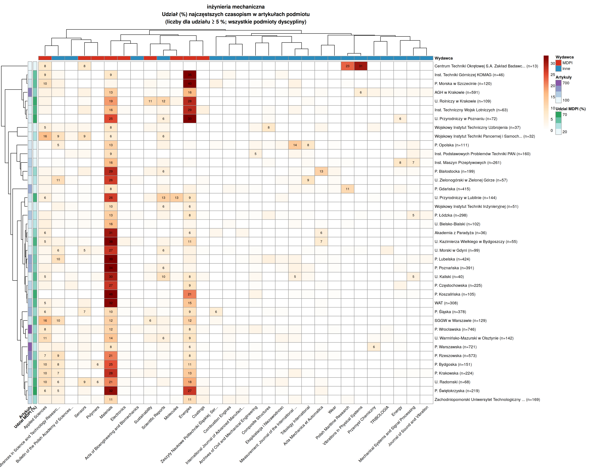

Dane: [tabela podmiot × czasopismo](czasopisma_dyscypliny/inzynieria_mechaniczna_kontyngencja.csv) · [zestawienie podmiotów](czasopisma_dyscypliny/inzynieria_mechaniczna_podmioty.csv) · [analiza korespondencji](czasopisma_dyscypliny/inzynieria_mechaniczna_korespondencja.png)

[↑ spis treści](#spis-treści)

## Inżynieria środowiska, górnictwo i energetyka

Artykuły: **7 561** · podmioty: **43** · czasopisma: **748** · udział MDPI: **38.1%**

| # | Czasopismo | Artykuły | % udziału |
|---|------------|---------:|----------:|
| 1 | Energies \* | 1418 | 18.8% |
| 2 | Materials \* | 389 | 5.1% |
| 3 | Sustainability \* | 253 | 3.3% |
| 4 | Energy | 251 | 3.3% |
| 5 | Scientific Reports | 220 | 2.9% |

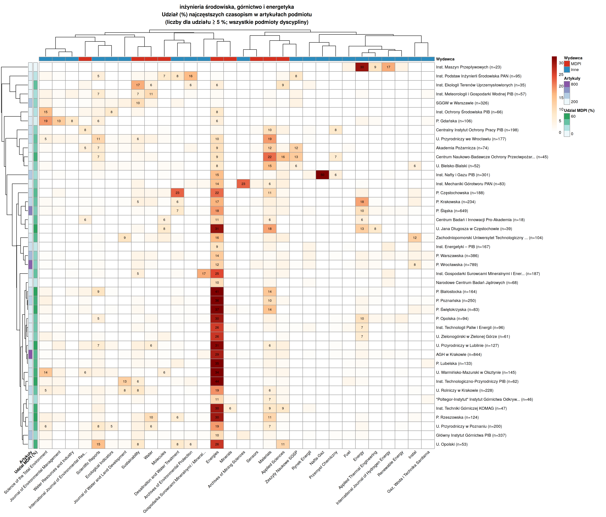

Dane: [tabela podmiot × czasopismo](czasopisma_dyscypliny/inzynieria_srodowiska_gornictwo_i_energetyka_kontyngencja.csv) · [zestawienie podmiotów](czasopisma_dyscypliny/inzynieria_srodowiska_gornictwo_i_energetyka_podmioty.csv) · [analiza korespondencji](czasopisma_dyscypliny/inzynieria_srodowiska_gornictwo_i_energetyka_korespondencja.png)

[↑ spis treści](#spis-treści)

## Językoznawstwo

Artykuły: **4 336** · podmioty: **30** · czasopisma: **715** · udział MDPI: **0.3%**

| # | Czasopismo | Artykuły | % udziału |
|---|------------|---------:|----------:|
| 1 | Prace Językoznawcze | 222 | 5.1% |
| 2 | Roczniki Humanistyczne | 188 | 4.3% |
| 3 | Jezyk Polski | 130 | 3.0% |
| 4 | Academic Journal of Modern Philology | 103 | 2.4% |
| 5 | Poradnik Językowy | 101 | 2.3% |

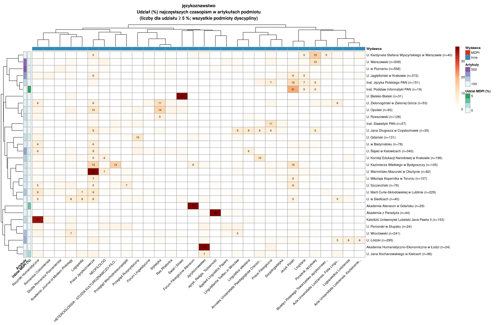

Dane: [tabela podmiot × czasopismo](czasopisma_dyscypliny/jezykoznawstwo_kontyngencja.csv) · [zestawienie podmiotów](czasopisma_dyscypliny/jezykoznawstwo_podmioty.csv) · [analiza korespondencji](czasopisma_dyscypliny/jezykoznawstwo_korespondencja.png)

[↑ spis treści](#spis-treści)

## Literaturoznawstwo

Artykuły: **4 172** · podmioty: **26** · czasopisma: **653** · udział MDPI: **0.2%**

| # | Czasopismo | Artykuły | % udziału |
|---|------------|---------:|----------:|
| 1 | Teksty Drugie | 169 | 4.1% |
| 2 | Roczniki Humanistyczne | 160 | 3.8% |
| 3 | Pamiętnik Literacki | 133 | 3.2% |
| 4 | Przegląd Rusycystyczny | 69 | 1.7% |
| 5 | Przestrzenie Teorii | 69 | 1.7% |

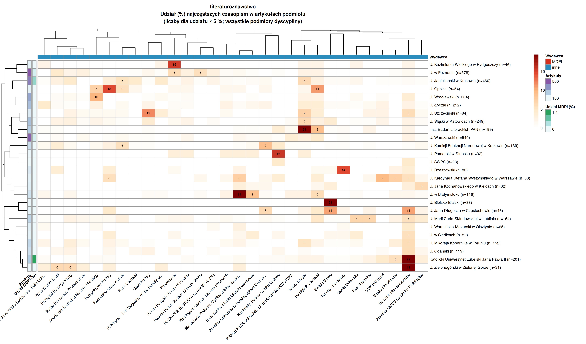

Dane: [tabela podmiot × czasopismo](czasopisma_dyscypliny/literaturoznawstwo_kontyngencja.csv) · [zestawienie podmiotów](czasopisma_dyscypliny/literaturoznawstwo_podmioty.csv) · [analiza korespondencji](czasopisma_dyscypliny/literaturoznawstwo_korespondencja.png)

[↑ spis treści](#spis-treści)

## Matematyka

Artykuły: **3 074** · podmioty: **29** · czasopisma: **671** · udział MDPI: **3.9%**

| # | Czasopismo | Artykuły | % udziału |
|---|------------|---------:|----------:|
| 1 | Results in Mathematics | 119 | 3.9% |
| 2 | Journal of Functional Analysis | 59 | 1.9% |
| 3 | Journal of Differential Equations | 58 | 1.9% |
| 4 | Mathematische Annalen | 51 | 1.7% |
| 5 | Symmetry \* | 46 | 1.5% |

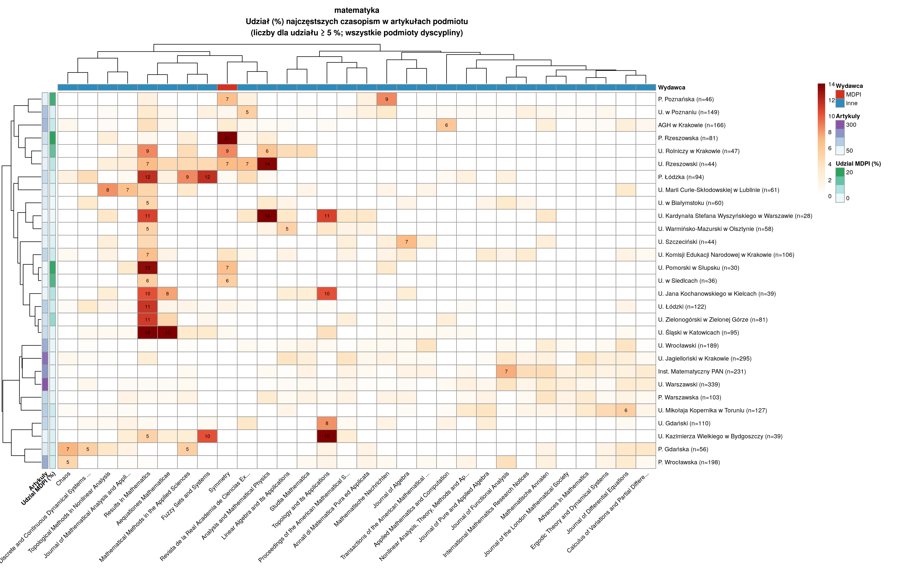

Dane: [tabela podmiot × czasopismo](czasopisma_dyscypliny/matematyka_kontyngencja.csv) · [zestawienie podmiotów](czasopisma_dyscypliny/matematyka_podmioty.csv) · [analiza korespondencji](czasopisma_dyscypliny/matematyka_korespondencja.png)

[↑ spis treści](#spis-treści)

## Nauki biblijne

Artykuły: **50** · podmioty: **2** · czasopisma: **13** · udział MDPI: **0.0%**

| # | Czasopismo | Artykuły | % udziału |
|---|------------|---------:|----------:|
| 1 | Biblical Annals | 19 | 38.0% |
| 2 | Polonia Sacra | 7 | 14.0% |
| 3 | Verbum Vitae | 6 | 12.0% |
| 4 | Collectanea Theologica | 4 | 8.0% |
| 5 | Biblica et Patristica Thoruniensia | 3 | 6.0% |

_Mapa ciepła nie została wygenerowana – zbyt mało podmiotów lub czasopism w dyscyplinie._

Dane: [zestawienie podmiotów](czasopisma_dyscypliny/nauki_biblijne_podmioty.csv)

[↑ spis treści](#spis-treści)

## Nauki biologiczne

Artykuły: **9 789** · podmioty: **42** · czasopisma: **1 343** · udział MDPI: **23.9%**

| # | Czasopismo | Artykuły | % udziału |
|---|------------|---------:|----------:|
| 1 | International Journal of Molecular Sciences \* | 977 | 10.0% |
| 2 | Scientific Reports | 814 | 8.3% |
| 3 | Molecules \* | 312 | 3.2% |
| 4 | Science of the Total Environment | 257 | 2.6% |
| 5 | European Zoological Journal | 181 | 1.8% |

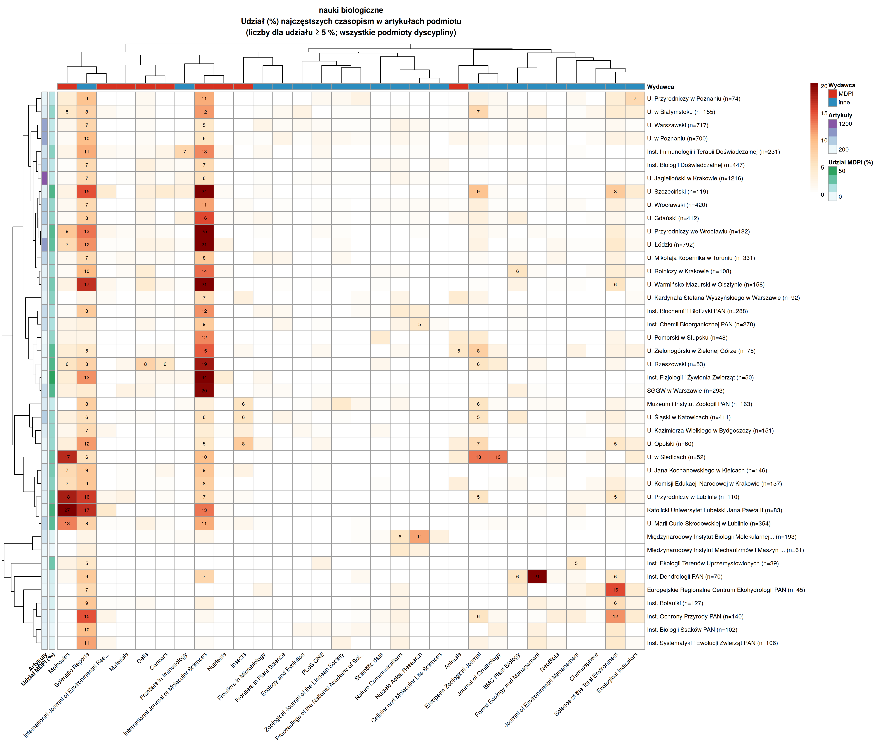

Dane: [tabela podmiot × czasopismo](czasopisma_dyscypliny/nauki_biologiczne_kontyngencja.csv) · [zestawienie podmiotów](czasopisma_dyscypliny/nauki_biologiczne_podmioty.csv) · [analiza korespondencji](czasopisma_dyscypliny/nauki_biologiczne_korespondencja.png)

[↑ spis treści](#spis-treści)

## Nauki chemiczne

Artykuły: **8 925** · podmioty: **35** · czasopisma: **727** · udział MDPI: **29.4%**

| # | Czasopismo | Artykuły | % udziału |
|---|------------|---------:|----------:|
| 1 | Molecules \* | 971 | 10.9% |
| 2 | International Journal of Molecular Sciences \* | 618 | 6.9% |
| 3 | Materials \* | 545 | 6.1% |
| 4 | Scientific Reports | 379 | 4.2% |
| 5 | Dalton Transactions | 172 | 1.9% |

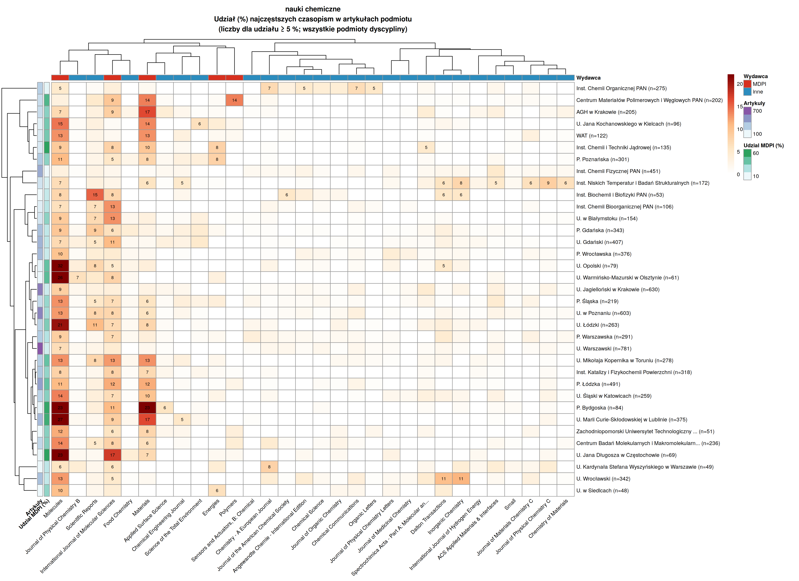

Dane: [tabela podmiot × czasopismo](czasopisma_dyscypliny/nauki_chemiczne_kontyngencja.csv) · [zestawienie podmiotów](czasopisma_dyscypliny/nauki_chemiczne_podmioty.csv) · [analiza korespondencji](czasopisma_dyscypliny/nauki_chemiczne_korespondencja.png)

[↑ spis treści](#spis-treści)

## Nauki farmaceutyczne

Artykuły: **3 785** · podmioty: **13** · czasopisma: **461** · udział MDPI: **59.4%**

| # | Czasopismo | Artykuły | % udziału |
|---|------------|---------:|----------:|
| 1 | International Journal of Molecular Sciences \* | 787 | 20.8% |
| 2 | Molecules \* | 596 | 15.7% |
| 3 | Nutrients \* | 158 | 4.2% |
| 4 | Scientific Reports | 133 | 3.5% |
| 5 | Journal of Clinical Medicine \* | 128 | 3.4% |

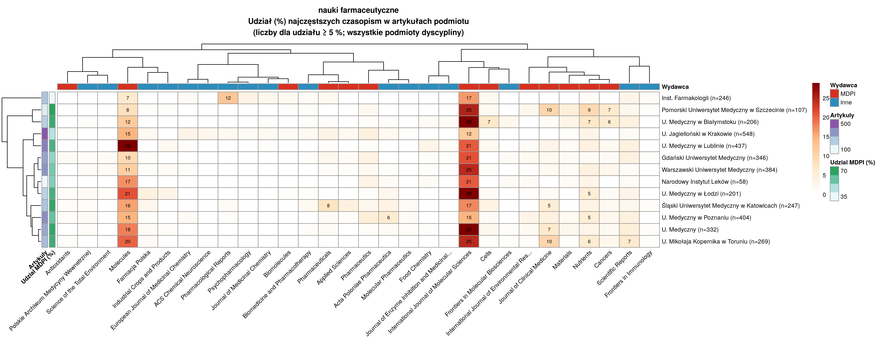

Dane: [tabela podmiot × czasopismo](czasopisma_dyscypliny/nauki_farmaceutyczne_kontyngencja.csv) · [zestawienie podmiotów](czasopisma_dyscypliny/nauki_farmaceutyczne_podmioty.csv) · [analiza korespondencji](czasopisma_dyscypliny/nauki_farmaceutyczne_korespondencja.png)

[↑ spis treści](#spis-treści)

## Nauki fizyczne

Artykuły: **7 776** · podmioty: **33** · czasopisma: **612** · udział MDPI: **9.2%**

| # | Czasopismo | Artykuły | % udziału |
|---|------------|---------:|----------:|
| 1 | Physical Review Letters | 605 | 7.8% |
| 2 | Physical Review B | 450 | 5.8% |
| 3 | Physical Review D | 447 | 5.7% |
| 4 | Scientific Reports | 360 | 4.6% |
| 5 | Materials \* | 333 | 4.3% |

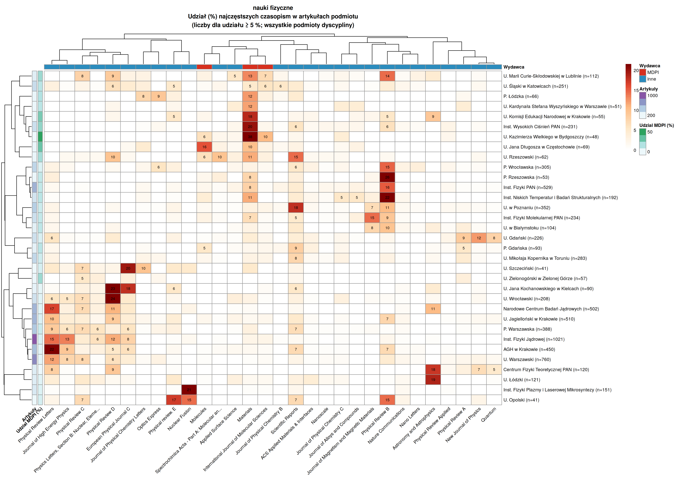

Dane: [tabela podmiot × czasopismo](czasopisma_dyscypliny/nauki_fizyczne_kontyngencja.csv) · [zestawienie podmiotów](czasopisma_dyscypliny/nauki_fizyczne_podmioty.csv) · [analiza korespondencji](czasopisma_dyscypliny/nauki_fizyczne_korespondencja.png)

[↑ spis treści](#spis-treści)

## Nauki leśne

Artykuły: **1 408** · podmioty: **6** · czasopisma: **230** · udział MDPI: **36.5%**

| # | Czasopismo | Artykuły | % udziału |
|---|------------|---------:|----------:|
| 1 | Forests \* | 149 | 10.6% |
| 2 | Materials \* | 107 | 7.6% |
| 3 | Sylwan | 93 | 6.6% |
| 4 | Forest Ecology and Management | 69 | 4.9% |
| 5 | Scientific Reports | 58 | 4.1% |

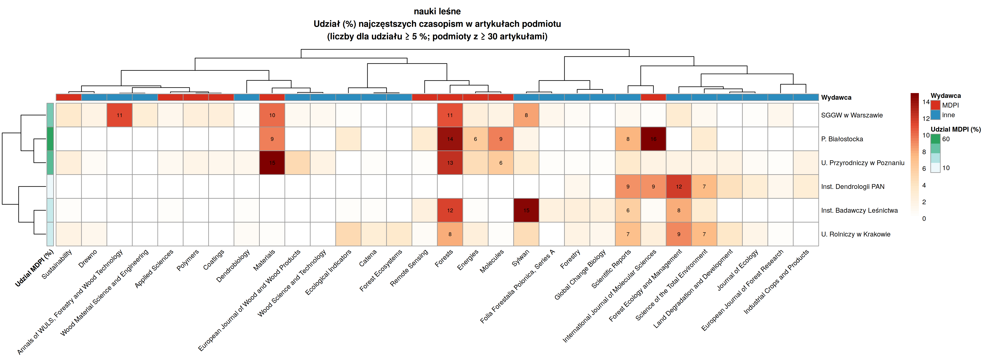

Dane: [tabela podmiot × czasopismo](czasopisma_dyscypliny/nauki_lesne_kontyngencja.csv) · [zestawienie podmiotów](czasopisma_dyscypliny/nauki_lesne_podmioty.csv) · [analiza korespondencji](czasopisma_dyscypliny/nauki_lesne_korespondencja.png)

[↑ spis treści](#spis-treści)

## Nauki medyczne

Artykuły: **24 662** · podmioty: **54** · czasopisma: **2 207** · udział MDPI: **41.8%**

| # | Czasopismo | Artykuły | % udziału |
|---|------------|---------:|----------:|
| 1 | Journal of Clinical Medicine \* | 3028 | 12.3% |
| 2 | International Journal of Molecular Sciences \* | 2432 | 9.9% |
| 3 | Cancers \* | 925 | 3.8% |
| 4 | Scientific Reports | 841 | 3.4% |
| 5 | Polskie Archiwum Medycyny Wewnetrznej | 776 | 3.1% |

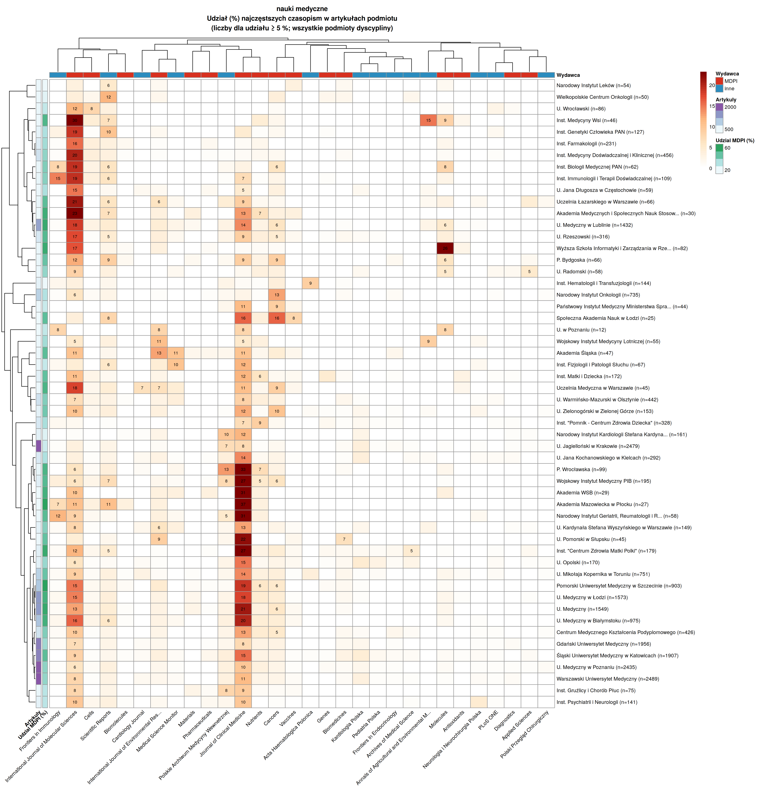

Dane: [tabela podmiot × czasopismo](czasopisma_dyscypliny/nauki_medyczne_kontyngencja.csv) · [zestawienie podmiotów](czasopisma_dyscypliny/nauki_medyczne_podmioty.csv) · [analiza korespondencji](czasopisma_dyscypliny/nauki_medyczne_korespondencja.png)

[↑ spis treści](#spis-treści)

## Nauki o bezpieczeństwie

Artykuły: **1 047** · podmioty: **21** · czasopisma: **205** · udział MDPI: **4.7%**

| # | Czasopismo | Artykuły | % udziału |
|---|------------|---------:|----------:|
| 1 | European Research Studies Journal | 70 | 6.7% |
| 2 | Studia Wschodnioeuropejskie | 52 | 5.0% |
| 3 | Journal of Modern Science | 50 | 4.8% |
| 4 | Politeja | 43 | 4.1% |
| 5 | Zeszyty Naukowe SGSP | 43 | 4.1% |

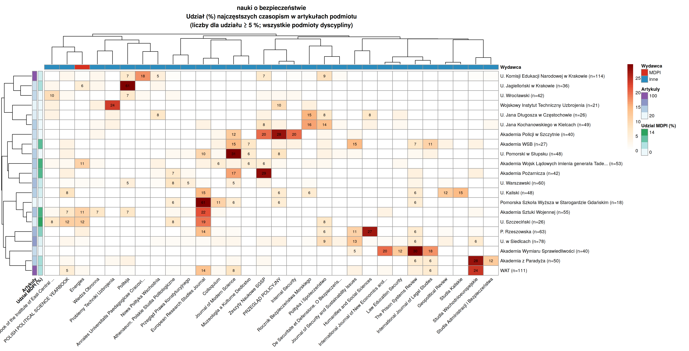

Dane: [tabela podmiot × czasopismo](czasopisma_dyscypliny/nauki_o_bezpieczenstwie_kontyngencja.csv) · [zestawienie podmiotów](czasopisma_dyscypliny/nauki_o_bezpieczenstwie_podmioty.csv) · [analiza korespondencji](czasopisma_dyscypliny/nauki_o_bezpieczenstwie_korespondencja.png)

[↑ spis treści](#spis-treści)

## Nauki o komunikacji społecznej i mediach

Artykuły: **1 151** · podmioty: **18** · czasopisma: **389** · udział MDPI: **1.3%**

| # | Czasopismo | Artykuły | % udziału |
|---|------------|---------:|----------:|
| 1 | Annales Universitatis Paedagogicae Cracoviensis \| Studia ad Bibliothecarum Scientiam Pertinentia | 92 | 8.0% |
| 2 | Przegląd Biblioteczny | 61 | 5.3% |
| 3 | Culture-Media-Theology | 39 | 3.4% |
| 4 | Media - Business - Culture. Journalism and social communication | 27 | 2.3% |
| 5 | Perspektywy Kultury | 23 | 2.0% |

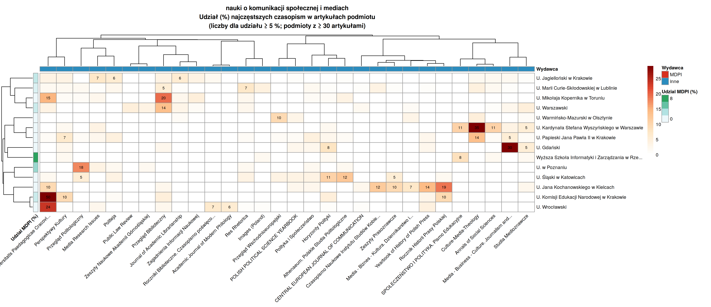

Dane: [tabela podmiot × czasopismo](czasopisma_dyscypliny/nauki_o_komunikacji_spolecznej_i_mediach_kontyngencja.csv) · [zestawienie podmiotów](czasopisma_dyscypliny/nauki_o_komunikacji_spolecznej_i_mediach_podmioty.csv) · [analiza korespondencji](czasopisma_dyscypliny/nauki_o_komunikacji_spolecznej_i_mediach_korespondencja.png)

[↑ spis treści](#spis-treści)

## Nauki o kulturze fizycznej

Artykuły: **1 896** · podmioty: **12** · czasopisma: **242** · udział MDPI: **41.8%**

| # | Czasopismo | Artykuły | % udziału |
|---|------------|---------:|----------:|
| 1 | Journal of Clinical Medicine \* | 247 | 13.0% |
| 2 | International Journal of Environmental Research and Public Health \* | 209 | 11.0% |
| 3 | Scientific Reports | 171 | 9.0% |
| 4 | Nutrients \* | 113 | 6.0% |
| 5 | Journal of Human Kinetics | 98 | 5.2% |

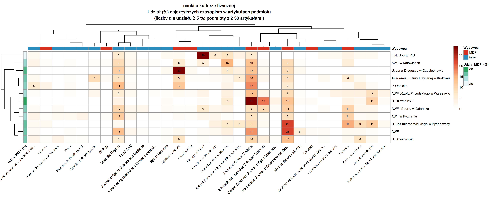

Dane: [tabela podmiot × czasopismo](czasopisma_dyscypliny/nauki_o_kulturze_fizycznej_kontyngencja.csv) · [zestawienie podmiotów](czasopisma_dyscypliny/nauki_o_kulturze_fizycznej_podmioty.csv) · [analiza korespondencji](czasopisma_dyscypliny/nauki_o_kulturze_fizycznej_korespondencja.png)

[↑ spis treści](#spis-treści)

## Nauki o kulturze i religii

Artykuły: **1 802** · podmioty: **19** · czasopisma: **565** · udział MDPI: **1.6%**

| # | Czasopismo | Artykuły | % udziału |
|---|------------|---------:|----------:|
| 1 | Perspektywy Kultury | 104 | 5.8% |
| 2 | Teksty Drugie | 72 | 4.0% |
| 3 | Kwartalnik Filmowy | 66 | 3.7% |
| 4 | The Religious Studies Review | 49 | 2.7% |
| 5 | Kultura Współczesna. Teoria, Interpretacje, Praktyka | 43 | 2.4% |

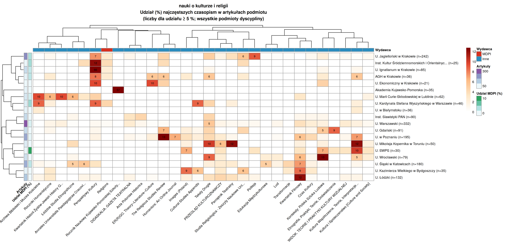

Dane: [tabela podmiot × czasopismo](czasopisma_dyscypliny/nauki_o_kulturze_i_religii_kontyngencja.csv) · [zestawienie podmiotów](czasopisma_dyscypliny/nauki_o_kulturze_i_religii_podmioty.csv) · [analiza korespondencji](czasopisma_dyscypliny/nauki_o_kulturze_i_religii_korespondencja.png)

[↑ spis treści](#spis-treści)

## Nauki o polityce i administracji

Artykuły: **2 353** · podmioty: **31** · czasopisma: **494** · udział MDPI: **1.4%**

| # | Czasopismo | Artykuły | % udziału |
|---|------------|---------:|----------:|
| 1 | Politeja | 169 | 7.2% |
| 2 | Przegląd Prawa Konstytucyjnego | 118 | 5.0% |
| 3 | Athenaeum. Polskie Studia Politologiczne | 116 | 4.9% |
| 4 | Studia Politologiczne | 80 | 3.4% |
| 5 | Horyzonty Polityki | 75 | 3.2% |

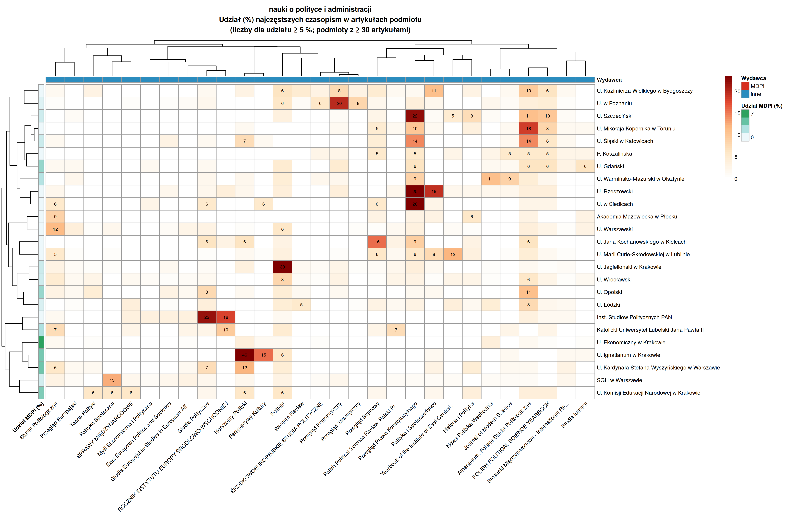

Dane: [tabela podmiot × czasopismo](czasopisma_dyscypliny/nauki_o_polityce_i_administracji_kontyngencja.csv) · [zestawienie podmiotów](czasopisma_dyscypliny/nauki_o_polityce_i_administracji_podmioty.csv) · [analiza korespondencji](czasopisma_dyscypliny/nauki_o_polityce_i_administracji_korespondencja.png)

[↑ spis treści](#spis-treści)

## Nauki o rodzinie

Artykuły: **160** · podmioty: **6** · czasopisma: **72** · udział MDPI: **10.0%**

| # | Czasopismo | Artykuły | % udziału |
|---|------------|---------:|----------:|
| 1 | Multidisciplinary Journal of School Education | 10 | 6.2% |
| 2 | Family Forum | 8 | 5.0% |
| 3 | Biuletyn Głównej Biblioteki Lekarskiej | 6 | 3.8% |
| 4 | Person and the Challenges-The Journal of Theology Education Canon Law and Social Studies Inspired by Pope John Paul II | 6 | 3.8% |
| 5 | Biografistyka Pedagogiczna | 5 | 3.1% |

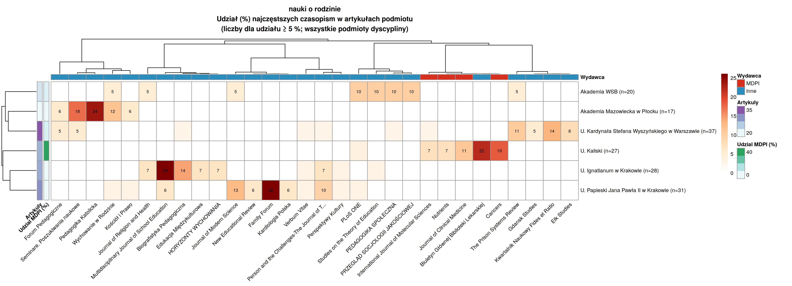

Dane: [tabela podmiot × czasopismo](czasopisma_dyscypliny/nauki_o_rodzinie_kontyngencja.csv) · [zestawienie podmiotów](czasopisma_dyscypliny/nauki_o_rodzinie_podmioty.csv) · [analiza korespondencji](czasopisma_dyscypliny/nauki_o_rodzinie_korespondencja.png)

[↑ spis treści](#spis-treści)

## Nauki o sztuce

Artykuły: **1 090** · podmioty: **15** · czasopisma: **266** · udział MDPI: **2.1%**

| # | Czasopismo | Artykuły | % udziału |
|---|------------|---------:|----------:|
| 1 | Biuletyn Historii Sztuki | 96 | 8.8% |
| 2 | Muzyka | 75 | 6.9% |
| 3 | Roczniki Humanistyczne | 64 | 5.9% |
| 4 | Konteksty: Polska Sztuka Ludowa | 59 | 5.4% |
| 5 | Quart. Kwartalnik Instytutu Historii Sztuki Uniwersytetu Wrocławskiego | 56 | 5.1% |

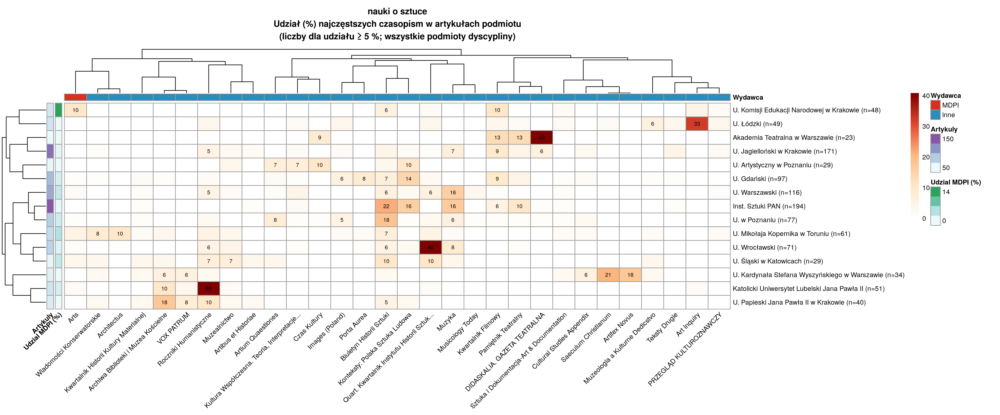

Dane: [tabela podmiot × czasopismo](czasopisma_dyscypliny/nauki_o_sztuce_kontyngencja.csv) · [zestawienie podmiotów](czasopisma_dyscypliny/nauki_o_sztuce_podmioty.csv) · [analiza korespondencji](czasopisma_dyscypliny/nauki_o_sztuce_korespondencja.png)

[↑ spis treści](#spis-treści)

## Nauki o zarządzaniu i jakości

Artykuły: **6 907** · podmioty: **60** · czasopisma: **860** · udział MDPI: **20.4%**

| # | Czasopismo | Artykuły | % udziału |
|---|------------|---------:|----------:|
| 1 | Zeszyty Naukowe Politechniki Śląskiej. Seria Organizacja i Zarządzanie | 926 | 13.4% |
| 2 | Energies \* | 738 | 10.7% |
| 3 | European Research Studies Journal | 626 | 9.1% |
| 4 | Sustainability \* | 449 | 6.5% |
| 5 | Zeszyty Naukowe. Organizacja i Zarządzanie/Politechnika Śląska | 175 | 2.5% |

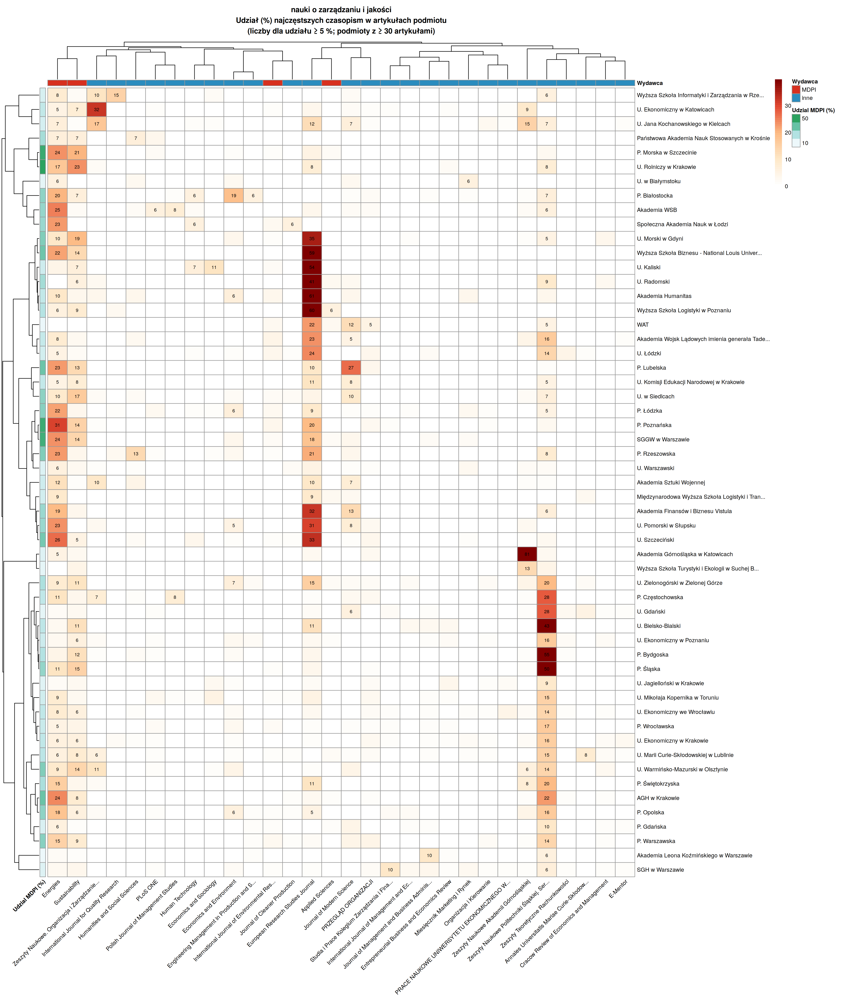

Dane: [tabela podmiot × czasopismo](czasopisma_dyscypliny/nauki_o_zarzadzaniu_i_jakosci_kontyngencja.csv) · [zestawienie podmiotów](czasopisma_dyscypliny/nauki_o_zarzadzaniu_i_jakosci_podmioty.csv) · [analiza korespondencji](czasopisma_dyscypliny/nauki_o_zarzadzaniu_i_jakosci_korespondencja.png)

[↑ spis treści](#spis-treści)

## Nauki o zdrowiu

Artykuły: **5 899** · podmioty: **37** · czasopisma: **919** · udział MDPI: **48.0%**

| # | Czasopismo | Artykuły | % udziału |
|---|------------|---------:|----------:|
| 1 | Journal of Clinical Medicine \* | 703 | 11.9% |
| 2 | International Journal of Environmental Research and Public Health \* | 526 | 8.9% |
| 3 | Nutrients \* | 461 | 7.8% |
| 4 | International Journal of Molecular Sciences \* | 417 | 7.1% |
| 5 | Scientific Reports | 233 | 3.9% |

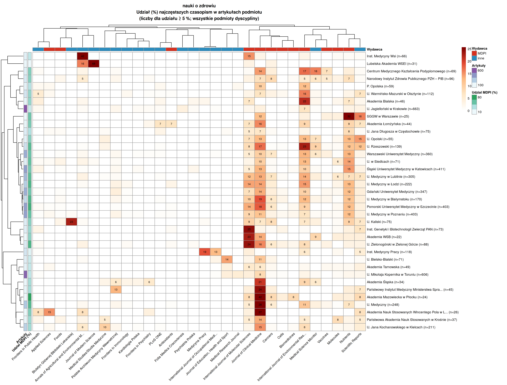

Dane: [tabela podmiot × czasopismo](czasopisma_dyscypliny/nauki_o_zdrowiu_kontyngencja.csv) · [zestawienie podmiotów](czasopisma_dyscypliny/nauki_o_zdrowiu_podmioty.csv) · [analiza korespondencji](czasopisma_dyscypliny/nauki_o_zdrowiu_korespondencja.png)

[↑ spis treści](#spis-treści)

## Nauki o Ziemi i środowisku

Artykuły: **4 411** · podmioty: **26** · czasopisma: **701** · udział MDPI: **12.2%**

| # | Czasopismo | Artykuły | % udziału |
|---|------------|---------:|----------:|
| 1 | Scientific Reports | 178 | 4.0% |
| 2 | Science of the Total Environment | 165 | 3.7% |
| 3 | Geological Quarterly | 147 | 3.3% |
| 4 | Catena | 116 | 2.6% |
| 5 | Water \* | 102 | 2.3% |

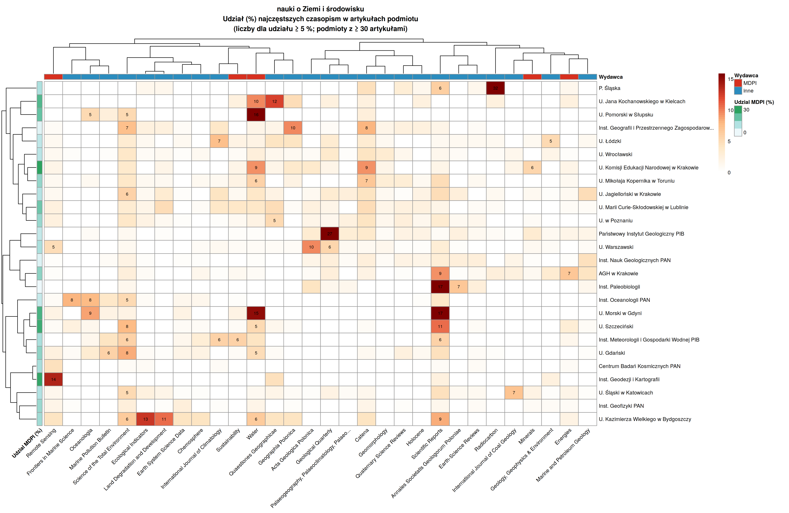

Dane: [tabela podmiot × czasopismo](czasopisma_dyscypliny/nauki_o_ziemi_i_srodowisku_kontyngencja.csv) · [zestawienie podmiotów](czasopisma_dyscypliny/nauki_o_ziemi_i_srodowisku_podmioty.csv) · [analiza korespondencji](czasopisma_dyscypliny/nauki_o_ziemi_i_srodowisku_korespondencja.png)

[↑ spis treści](#spis-treści)

## Nauki prawne

Artykuły: **6 708** · podmioty: **40** · czasopisma: **529** · udział MDPI: **0.6%**

| # | Czasopismo | Artykuły | % udziału |
|---|------------|---------:|----------:|
| 1 | Prawo i Więź | 387 | 5.8% |
| 2 | Przegląd Prawa Konstytucyjnego | 288 | 4.3% |
| 3 | Przegląd Ustawodawstwa Gospodarczego | 221 | 3.3% |
| 4 | Praca i Zabezpieczenie Społeczne | 213 | 3.2% |
| 5 | STUDIA PRAWNOUSTROJOWE | 211 | 3.1% |

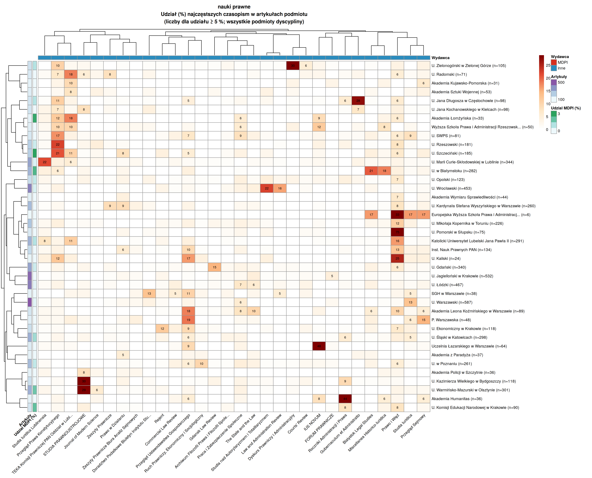

Dane: [tabela podmiot × czasopismo](czasopisma_dyscypliny/nauki_prawne_kontyngencja.csv) · [zestawienie podmiotów](czasopisma_dyscypliny/nauki_prawne_podmioty.csv) · [analiza korespondencji](czasopisma_dyscypliny/nauki_prawne_korespondencja.png)

[↑ spis treści](#spis-treści)

## Nauki socjologiczne

Artykuły: **2 121** · podmioty: **24** · czasopisma: **727** · udział MDPI: **3.3%**

| # | Czasopismo | Artykuły | % udziału |
|---|------------|---------:|----------:|
| 1 | Studia Socjologiczne | 67 | 3.2% |
| 2 | PRZEGLĄD SOCJOLOGII JAKOŚCIOWEJ | 62 | 2.9% |
| 3 | PRZEGLĄD SOCJOLOGICZNY | 50 | 2.4% |
| 4 | Kultura i Spoleczenstwo [Culture and Society] | 48 | 2.3% |
| 5 | Transformacje | 46 | 2.2% |

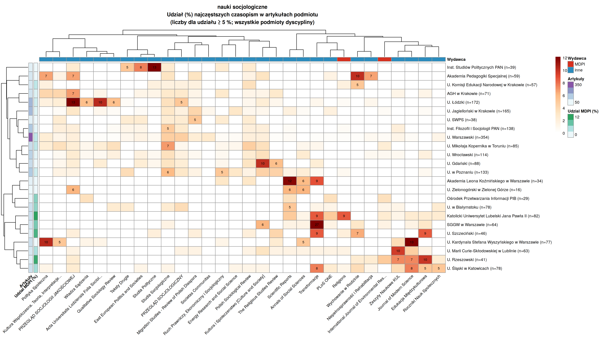

Dane: [tabela podmiot × czasopismo](czasopisma_dyscypliny/nauki_socjologiczne_kontyngencja.csv) · [zestawienie podmiotów](czasopisma_dyscypliny/nauki_socjologiczne_podmioty.csv) · [analiza korespondencji](czasopisma_dyscypliny/nauki_socjologiczne_korespondencja.png)

[↑ spis treści](#spis-treści)

## Nauki teologiczne

Artykuły: **950** · podmioty: **12** · czasopisma: **141** · udział MDPI: **4.5%**

| # | Czasopismo | Artykuły | % udziału |
|---|------------|---------:|----------:|
| 1 | Verbum Vitae | 102 | 10.7% |
| 2 | Collectanea Theologica | 58 | 6.1% |
| 3 | VOX PATRUM | 47 | 4.9% |
| 4 | Teologia i Człowiek | 44 | 4.6% |
| 5 | Polonia Sacra | 41 | 4.3% |

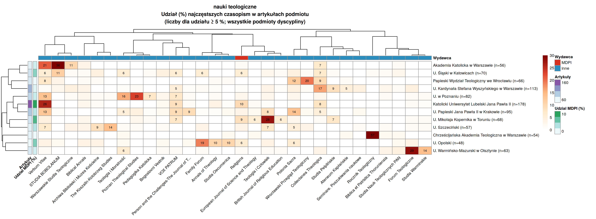

Dane: [tabela podmiot × czasopismo](czasopisma_dyscypliny/nauki_teologiczne_kontyngencja.csv) · [zestawienie podmiotów](czasopisma_dyscypliny/nauki_teologiczne_podmioty.csv) · [analiza korespondencji](czasopisma_dyscypliny/nauki_teologiczne_korespondencja.png)

[↑ spis treści](#spis-treści)

## Pedagogika

Artykuły: **4 135** · podmioty: **42** · czasopisma: **515** · udział MDPI: **2.5%**

| # | Czasopismo | Artykuły | % udziału |
|---|------------|---------:|----------:|
| 1 | Studies on the Theory of Education | 194 | 4.7% |
| 2 | Edukacja Międzykulturowa | 167 | 4.0% |
| 3 | Biografistyka Pedagogiczna | 155 | 3.7% |
| 4 | Wychowanie w Rodzinie | 129 | 3.1% |
| 5 | LUBELSKI ROCZNIK PEDAGOGICZNY | 117 | 2.8% |

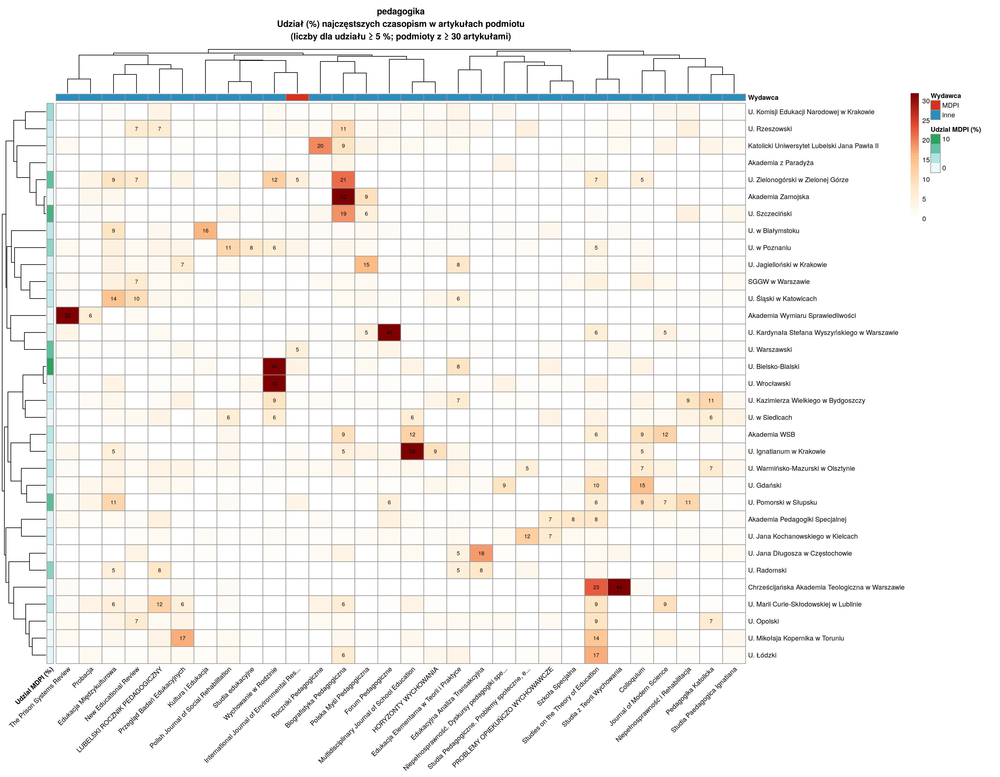

Dane: [tabela podmiot × czasopismo](czasopisma_dyscypliny/pedagogika_kontyngencja.csv) · [zestawienie podmiotów](czasopisma_dyscypliny/pedagogika_podmioty.csv) · [analiza korespondencji](czasopisma_dyscypliny/pedagogika_korespondencja.png)

[↑ spis treści](#spis-treści)

## Polonistyka

Artykuły: **163** · podmioty: **4** · czasopisma: **77** · udział MDPI: **0.0%**

| # | Czasopismo | Artykuły | % udziału |
|---|------------|---------:|----------:|
| 1 | Pamiętnik Literacki | 13 | 8.0% |
| 2 | Teksty Drugie | 12 | 7.4% |
| 3 | POSTSCRIPTUM POLONISTYCZNE | 9 | 5.5% |
| 4 | Konteksty: Polska Sztuka Ludowa | 7 | 4.3% |
| 5 | Annales Universitatis Paedagogicae Cracoviensis. Studia ad Didacticam Litterarum Polonarum et Linguae Polonae | 6 | 3.7% |

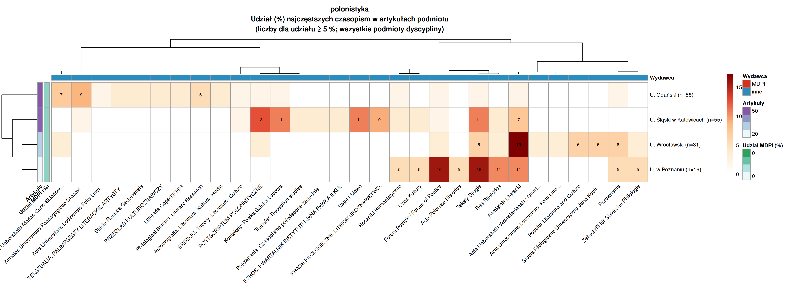

Dane: [tabela podmiot × czasopismo](czasopisma_dyscypliny/polonistyka_kontyngencja.csv) · [zestawienie podmiotów](czasopisma_dyscypliny/polonistyka_podmioty.csv) · [analiza korespondencji](czasopisma_dyscypliny/polonistyka_korespondencja.png)

[↑ spis treści](#spis-treści)

## Prawo kanoniczne

Artykuły: **117** · podmioty: **3** · czasopisma: **30** · udział MDPI: **6.0%**

| # | Czasopismo | Artykuły | % udziału |
|---|------------|---------:|----------:|
| 1 | Prawo Kanoniczne | 30 | 25.6% |
| 2 | TEKA Komisji Prawniczej PAN Oddział w Lublinie | 15 | 12.8% |
| 3 | Biuletyn Stowarzyszenia Absolwentów i Przyjaciół Wydziału Prawa Katolickiego Uniwersytetu Lubelskiego | 9 | 7.7% |
| 4 | Kościół i Prawo | 9 | 7.7% |
| 5 | Annales Canonici | 7 | 6.0% |

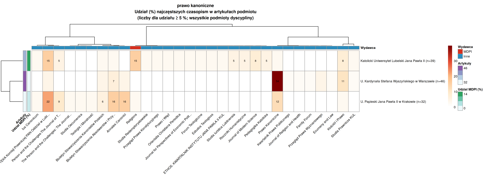

Dane: [tabela podmiot × czasopismo](czasopisma_dyscypliny/prawo_kanoniczne_kontyngencja.csv) · [zestawienie podmiotów](czasopisma_dyscypliny/prawo_kanoniczne_podmioty.csv)

[↑ spis treści](#spis-treści)

## Psychologia

Artykuły: **2 994** · podmioty: **24** · czasopisma: **761** · udział MDPI: **10.0%**

| # | Czasopismo | Artykuły | % udziału |
|---|------------|---------:|----------:|
| 1 | Scientific Reports | 160 | 5.3% |
| 2 | International Journal of Environmental Research and Public Health \* | 112 | 3.7% |
| 3 | PLoS ONE | 95 | 3.2% |
| 4 | Personality and Individual Differences | 72 | 2.4% |
| 5 | Psychiatria Polska | 64 | 2.1% |

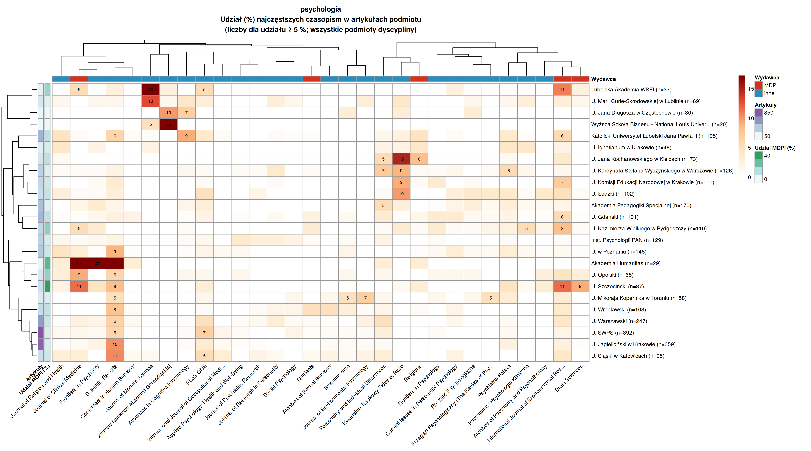

Dane: [tabela podmiot × czasopismo](czasopisma_dyscypliny/psychologia_kontyngencja.csv) · [zestawienie podmiotów](czasopisma_dyscypliny/psychologia_podmioty.csv) · [analiza korespondencji](czasopisma_dyscypliny/psychologia_korespondencja.png)

[↑ spis treści](#spis-treści)

## Rolnictwo i ogrodnictwo

Artykuły: **4 169** · podmioty: **19** · czasopisma: **459** · udział MDPI: **48.0%**

| # | Czasopismo | Artykuły | % udziału |
|---|------------|---------:|----------:|
| 1 | Agriculture \* | 406 | 9.7% |
| 2 | Agronomy \* | 337 | 8.1% |
| 3 | Molecules \* | 264 | 6.3% |
| 4 | Scientific Reports | 247 | 5.9% |
| 5 | International Journal of Molecular Sciences \* | 245 | 5.9% |

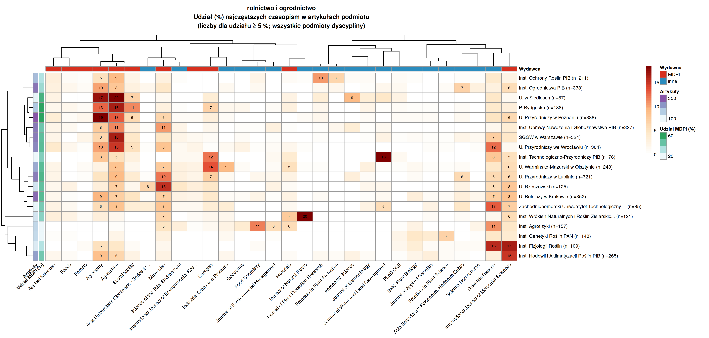

Dane: [tabela podmiot × czasopismo](czasopisma_dyscypliny/rolnictwo_i_ogrodnictwo_kontyngencja.csv) · [zestawienie podmiotów](czasopisma_dyscypliny/rolnictwo_i_ogrodnictwo_podmioty.csv) · [analiza korespondencji](czasopisma_dyscypliny/rolnictwo_i_ogrodnictwo_korespondencja.png)

[↑ spis treści](#spis-treści)

## Stosunki międzynarodowe

Artykuły: **304** · podmioty: **8** · czasopisma: **98** · udział MDPI: **5.3%**

| # | Czasopismo | Artykuły | % udziału |
|---|------------|---------:|----------:|
| 1 | Politeja | 55 | 18.1% |
| 2 | Stosunki Międzynarodowe - International Relations | 24 | 7.9% |
| 3 | Athenaeum. Polskie Studia Politologiczne | 20 | 6.6% |
| 4 | POLISH POLITICAL SCIENCE YEARBOOK | 19 | 6.2% |
| 5 | Yearbook of the Institute of East-Central Europe | 14 | 4.6% |

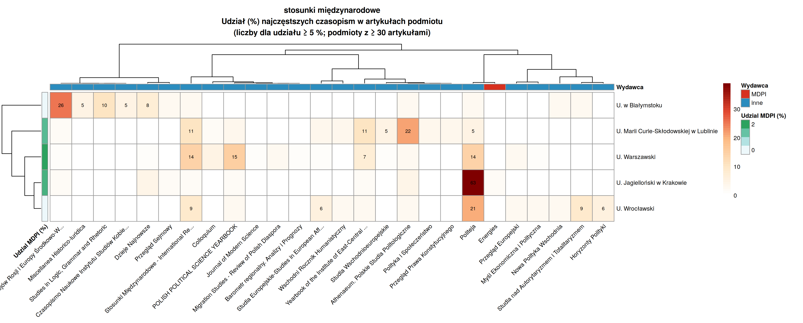

Dane: [tabela podmiot × czasopismo](czasopisma_dyscypliny/stosunki_miedzynarodowe_kontyngencja.csv) · [zestawienie podmiotów](czasopisma_dyscypliny/stosunki_miedzynarodowe_podmioty.csv) · [analiza korespondencji](czasopisma_dyscypliny/stosunki_miedzynarodowe_korespondencja.png)

[↑ spis treści](#spis-treści)

## Sztuki filmowe i teatralne

Artykuły: **3** · podmioty: **1** · czasopisma: **2** · udział MDPI: **0.0%**

| # | Czasopismo | Artykuły | % udziału |
|---|------------|---------:|----------:|
| 1 | Magazyn Filmowy Stowarzyszenia Filmowców Polskich | 2 | 66.7% |
| 2 | Culture Management | 1 | 33.3% |

_Mapa ciepła nie została wygenerowana – zbyt mało podmiotów lub czasopism w dyscyplinie._

Dane: [zestawienie podmiotów](czasopisma_dyscypliny/sztuki_filmowe_i_teatralne_podmioty.csv)

[↑ spis treści](#spis-treści)

## Sztuki muzyczne

Artykuły: **7** · podmioty: **4** · czasopisma: **5** · udział MDPI: **0.0%**

| # | Czasopismo | Artykuły | % udziału |
|---|------------|---------:|----------:|
| 1 | Music Science Today : the Permanent and the Changeable | 2 | 28.6% |
| 2 | Musicae Scientiae | 2 | 28.6% |
| 3 | International Journal of Eurasian Education and Culture | 1 | 14.3% |
| 4 | UczMy - Kujawsko-Pomorski Przegląd Oświatowy | 1 | 14.3% |
| 5 | Zbornik radova Akademije umetnosti | 1 | 14.3% |

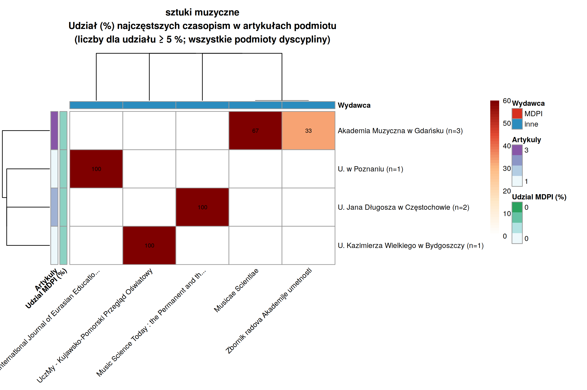

Dane: [tabela podmiot × czasopismo](czasopisma_dyscypliny/sztuki_muzyczne_kontyngencja.csv) · [zestawienie podmiotów](czasopisma_dyscypliny/sztuki_muzyczne_podmioty.csv) · [analiza korespondencji](czasopisma_dyscypliny/sztuki_muzyczne_korespondencja.png)

[↑ spis treści](#spis-treści)

## Sztuki plastyczne i konserwacja dzieł sztuki

Artykuły: **20** · podmioty: **8** · czasopisma: **16** · udział MDPI: **0.0%**

| # | Czasopismo | Artykuły | % udziału |
|---|------------|---------:|----------:|
| 1 | Heritage Science | 3 | 15.0% |
| 2 | Journal of Cultural Heritage | 3 | 15.0% |
| 3 | Antiquity | 1 | 5.0% |
| 4 | Dendrochronologia | 1 | 5.0% |
| 5 | Formy | 1 | 5.0% |

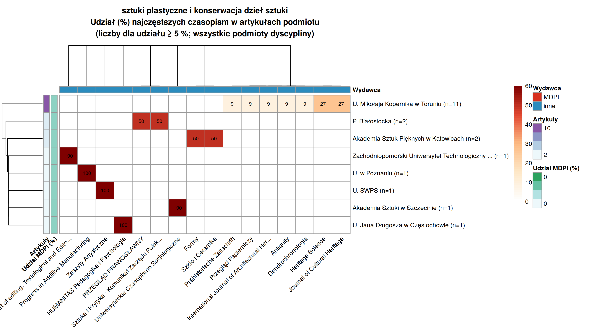

Dane: [tabela podmiot × czasopismo](czasopisma_dyscypliny/sztuki_plastyczne_i_konserwacja_dziel_sztuki_kontyngencja.csv) · [zestawienie podmiotów](czasopisma_dyscypliny/sztuki_plastyczne_i_konserwacja_dziel_sztuki_podmioty.csv) · [analiza korespondencji](czasopisma_dyscypliny/sztuki_plastyczne_i_konserwacja_dziel_sztuki_korespondencja.png)

[↑ spis treści](#spis-treści)

## Technologia żywności i żywienia

Artykuły: **2 886** · podmioty: **13** · czasopisma: **259** · udział MDPI: **63.0%**

| # | Czasopismo | Artykuły | % udziału |
|---|------------|---------:|----------:|
| 1 | Molecules \* | 596 | 20.7% |
| 2 | Applied Sciences \* | 257 | 8.9% |
| 3 | Nutrients \* | 256 | 8.9% |
| 4 | Foods \* | 226 | 7.8% |
| 5 | International Journal of Molecular Sciences \* | 202 | 7.0% |

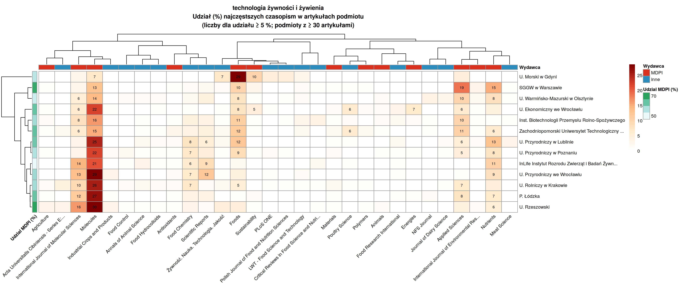

Dane: [tabela podmiot × czasopismo](czasopisma_dyscypliny/technologia_zywnosci_i_zywienia_kontyngencja.csv) · [zestawienie podmiotów](czasopisma_dyscypliny/technologia_zywnosci_i_zywienia_podmioty.csv) · [analiza korespondencji](czasopisma_dyscypliny/technologia_zywnosci_i_zywienia_korespondencja.png)

[↑ spis treści](#spis-treści)

## Weterynaria

Artykuły: **2 340** · podmioty: **8** · czasopisma: **345** · udział MDPI: **37.8%**

| # | Czasopismo | Artykuły | % udziału |
|---|------------|---------:|----------:|
| 1 | International Journal of Molecular Sciences \* | 196 | 8.4% |
| 2 | Journal of Veterinary Research (Poland) | 189 | 8.1% |
| 3 | Animals \* | 188 | 8.0% |
| 4 | Medycyna Weterynaryjna | 113 | 4.8% |
| 5 | BMC Veterinary Research | 108 | 4.6% |

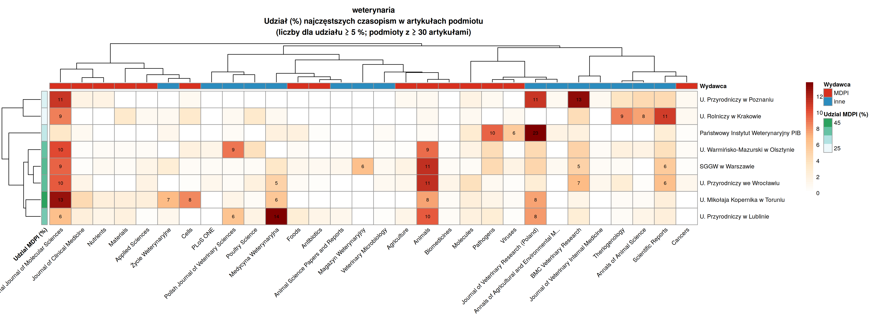

Dane: [tabela podmiot × czasopismo](czasopisma_dyscypliny/weterynaria_kontyngencja.csv) · [zestawienie podmiotów](czasopisma_dyscypliny/weterynaria_podmioty.csv) · [analiza korespondencji](czasopisma_dyscypliny/weterynaria_korespondencja.png)

[↑ spis treści](#spis-treści)

## Zootechnika i rybactwo

Artykuły: **2 358** · podmioty: **15** · czasopisma: **306** · udział MDPI: **33.6%**

| # | Czasopismo | Artykuły | % udziału |
|---|------------|---------:|----------:|
| 1 | Animals \* | 263 | 11.2% |
| 2 | International Journal of Molecular Sciences \* | 220 | 9.3% |
| 3 | Annals of Animal Science | 176 | 7.5% |
| 4 | Scientific Reports | 136 | 5.8% |
| 5 | Poultry Science | 100 | 4.2% |

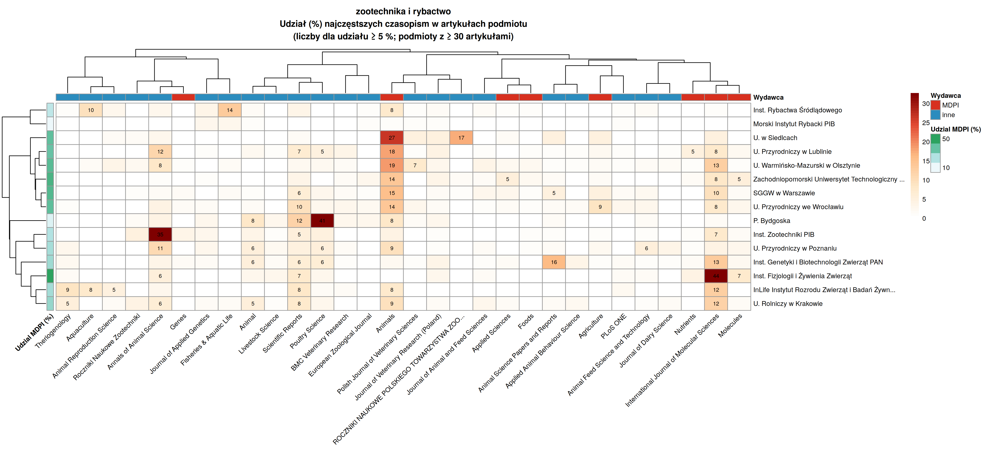

Dane: [tabela podmiot × czasopismo](czasopisma_dyscypliny/zootechnika_i_rybactwo_kontyngencja.csv) · [zestawienie podmiotów](czasopisma_dyscypliny/zootechnika_i_rybactwo_podmioty.csv) · [analiza korespondencji](czasopisma_dyscypliny/zootechnika_i_rybactwo_korespondencja.png)

[↑ spis treści](#spis-treści)

